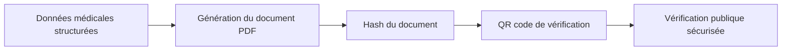
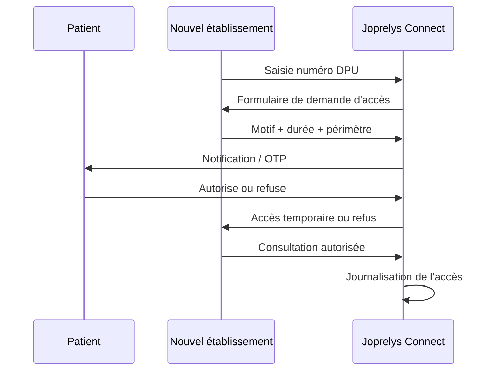
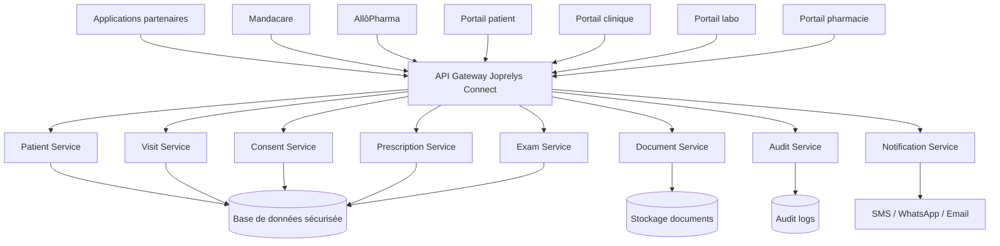
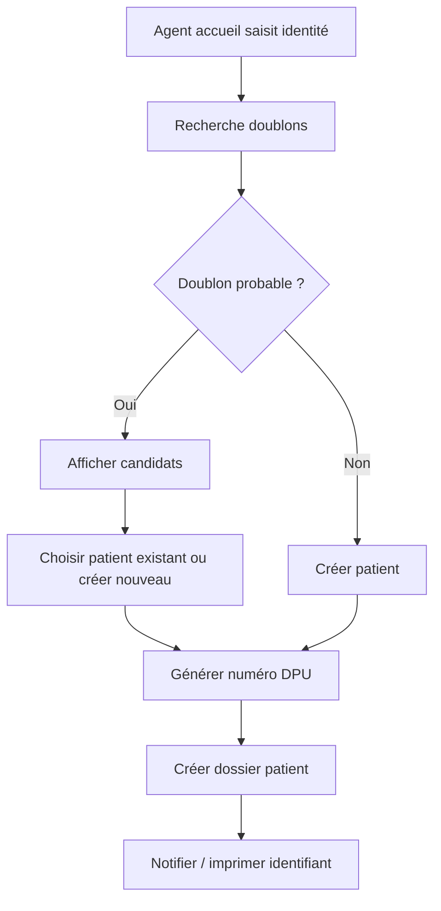
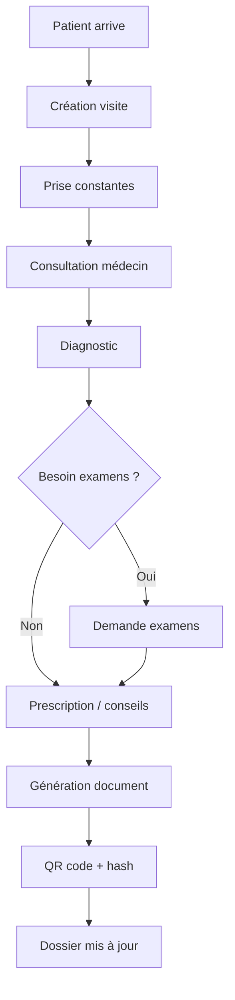
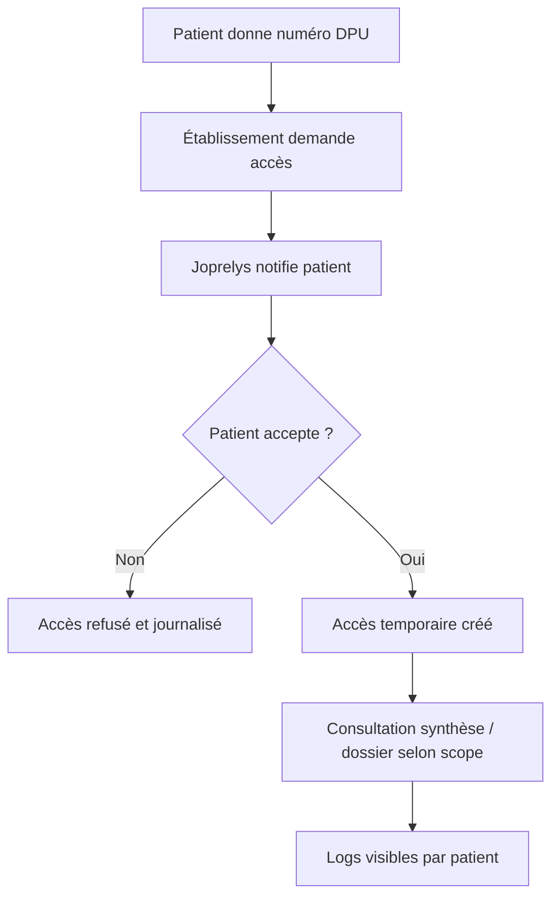
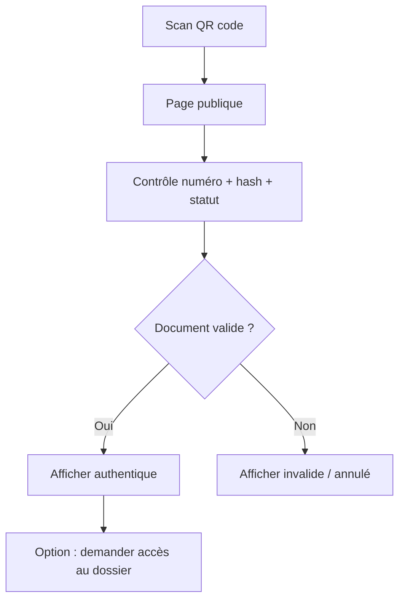

# Cahier des charges complet — Joprelys Connect

**Projet :** Joprelys Connect  
**Version :** 1.0  
**Date :** 2026-07-01  
**Produit :** Plateforme d’interopérabilité santé, dossier patient partagé et documents médicaux vérifiables  
**Éditeur envisagé :** Joprelys HealthTech  
**Slogan court recommandé :** Parce que chaque vie compte.  
**Slogan long recommandé :** Parce que chaque vie compte, nous protégeons l’essentiel.  

---

## 1. Résumé exécutif

**Joprelys Connect** est une plateforme d’interopérabilité santé destinée à connecter les hôpitaux, cliniques, laboratoires, pharmacies, médecins, patients et applications santé autour d’un socle commun sécurisé.

Le produit vise à résoudre un problème majeur : les informations médicales d’un patient sont souvent dispersées entre plusieurs structures. Un patient peut consulter dans une clinique, réaliser des examens dans un laboratoire, acheter ses médicaments dans une pharmacie, puis changer d’hôpital sans que ses informations le suivent correctement.

Joprelys Connect doit donc devenir un **socle de continuité des soins** :

- un patient garde un historique médical structuré ;
- un établissement peut produire des documents médicaux vérifiables ;
- un professionnel autorisé peut demander un accès temporaire au dossier ;
- le patient garde le contrôle de ses données ;
- chaque accès est tracé ;
- les futures applications santé de Joprelys peuvent communiquer par API.

Le projet doit commencer par un pilote maîtrisé avant d’être présenté comme solution d’interopérabilité plus large.

---

## 2. Sources et références de cadrage

Ce cahier des charges est construit à partir :

1. Des besoins exprimés autour d’un dossier patient complet, avec historique des visites, examens, résultats, prescriptions et documents.
2. Du document de démonstration fourni : **Fiche Patient Chantal Demo Sortie**, contenant déjà un numéro patient, une fiche d’accueil, des constantes, un diagnostic, des prescriptions, des signatures et un QR code de vérification.
3. De la stratégie de santé numérique du Cameroun, qui vise un écosystème de santé numérique intégré, interopérable, sécurisé et centré sur l’individu.
4. Des pratiques internationales d’interopérabilité, notamment la logique HL7 FHIR.
5. Des exigences de protection des données personnelles applicables au Cameroun.

### Références officielles utiles

- Plan Stratégique National de Santé Numérique 2026-2030, MINSANTE Cameroun :  
  https://www.minsante.cm/site/sites/default/files/PSNSN%202026-2030%20Fr.pdf
- Loi n°2024/017 du 23 décembre 2024 relative à la protection des données à caractère personnel au Cameroun :  
  https://prc.cm/fr/multimedia/documents/10258-loi-n-2024-017-du-23-12-2024-web
- Spécification HL7 FHIR R4 :  
  https://hl7.org/fhir/R4/
- OWASP API Security Project :  
  https://owasp.org/www-project-api-security/
- OWASP ASVS :  
  https://owasp.org/www-project-application-security-verification-standard/

---

## 3. Vision produit

### 3.1 Vision générale

Joprelys Connect doit permettre à plusieurs plateformes santé de communiquer de façon sécurisée autour d’un même patient.

La vision n’est pas de créer un simple PDF médical. La vision est de créer une **base médicale vivante**, exposée à travers une API sécurisée et des interfaces adaptées.

Le PDF devient une sortie officielle du dossier, avec un QR code de vérification, mais il ne doit jamais être la source unique de vérité.

### 3.2 Phrase de positionnement

> Joprelys Connect connecte les acteurs de santé autour d’un dossier patient sécurisé, traçable et partageable avec l’accord du patient.

### 3.3 Promesse produit

> Un patient ne perd plus son historique médical lorsqu’il change d’établissement.  
> Un document médical peut être vérifié en ligne.  
> Un médecin peut consulter les informations essentielles avec l’accord du patient.  
> Les cliniques, laboratoires, pharmacies et plateformes santé peuvent enfin communiquer.

---

## 4. Objectifs du projet

### 4.1 Objectif principal

Mettre en place une plateforme API sécurisée permettant de créer, conserver, partager et vérifier les données médicales d’un patient entre plusieurs acteurs de santé.

### 4.2 Objectifs fonctionnels

Joprelys Connect doit permettre de :

1. Créer un dossier patient unique.
2. Gérer l’identité patient et limiter les doublons.
3. Enregistrer les visites et consultations.
4. Enregistrer les constantes vitales.
5. Gérer les allergies, antécédents et traitements chroniques.
6. Gérer les diagnostics.
7. Créer des prescriptions et ordonnances vérifiables.
8. Créer et suivre les demandes d’examens.
9. Gérer les résultats de laboratoire et autres examens.
10. Gérer les hospitalisations.
11. Générer des documents médicaux PDF.
12. Vérifier l’authenticité des documents par QR code.
13. Permettre au patient d’autoriser ou refuser une demande d’accès.
14. Donner un accès temporaire à un professionnel externe.
15. Tracer toutes les actions sensibles.
16. Exposer des API pour connecter Mandacare, AllôPharma et d’autres plateformes.
17. Préparer une compatibilité progressive avec HL7 FHIR.

### 4.3 Objectifs stratégiques

Joprelys Connect doit :

- créer une infrastructure numérique de continuité des soins ;
- renforcer la crédibilité de Joprelys HealthTech ;
- faciliter les discussions avec cliniques, laboratoires, pharmacies et institutions ;
- servir de socle technique pour les futurs produits santé ;
- démontrer rapidement de la valeur via un pilote simple.

---

## 5. Périmètre du produit

### 5.1 Inclus dans le périmètre

Le périmètre complet inclut :

- gestion des établissements ;
- gestion des professionnels ;
- gestion des patients ;
- dossier patient partagé ;
- consultations ;
- constantes ;
- diagnostics ;
- prescriptions ;
- examens ;
- résultats ;
- hospitalisations ;
- documents médicaux ;
- QR codes ;
- consentements ;
- demandes d’accès ;
- accès temporaires ;
- audit logs ;
- API Gateway ;
- webhooks ;
- portail patient ;
- portail professionnel ;
- portail établissement ;
- portail administrateur ;
- portail de vérification publique ;
- connecteurs vers applications partenaires.

### 5.2 Hors périmètre initial

Les éléments suivants ne doivent pas être imposés dans la première version :

- dossier médical national officiel ;
- connexion immédiate à tous les hôpitaux du Cameroun ;
- intégration complète DHIS2 ;
- stockage DICOM lourd pour scanner / IRM ;
- facturation assurance complète ;
- intégration bancaire complète ;
- application mobile complète pour tous les rôles ;
- IA médicale ou diagnostic automatisé ;
- reconnaissance institutionnelle officielle avant pilote.

---

## 6. Principes fondamentaux

### 6.1 Le numéro patient ne donne jamais accès directement au dossier

Le numéro patient ou numéro de dossier permet de retrouver le dossier, mais il ne doit pas permettre de l’ouvrir sans autorisation.

Exemple :

```text
DPU-JOP-20260701-000103
```

Ce numéro permet de demander l’accès. Il ne permet pas de consulter librement les données médicales.

### 6.2 Le patient contrôle l’accès à ses données

Le patient doit pouvoir :

- voir son dossier ;
- autoriser une demande d’accès ;
- refuser une demande ;
- révoquer un accès ;
- consulter l’historique des accès.

### 6.3 Les professionnels n’accèdent qu’aux informations nécessaires

L’accès doit être limité selon :

- le rôle du professionnel ;
- l’établissement ;
- le motif ;
- le consentement ;
- la durée ;
- le niveau d’urgence.

### 6.4 Toute action sensible est journalisée

Chaque accès et chaque action importante doivent être enregistrés.

### 6.5 Le PDF est un document de sortie

La base de données structurée est la source de vérité.

Flux recommandé :



### 6.6 Compatibilité progressive avec HL7 FHIR

Le système doit être conçu pour pouvoir mapper progressivement ses données vers les ressources FHIR :

- Patient ;
- Organization ;
- Practitioner ;
- Encounter ;
- Observation ;
- Condition ;
- MedicationRequest ;
- ServiceRequest ;
- DiagnosticReport ;
- DocumentReference ;
- Consent.

---

## 7. Acteurs et utilisateurs

### 7.1 Patient

Le patient est le propriétaire logique de son dossier. Il ne saisit pas forcément toutes les données, mais il contrôle les accès externes.

Fonctionnalités attendues :

- consulter son profil ;
- consulter ses visites ;
- consulter ses ordonnances ;
- consulter ses résultats ;
- télécharger ses documents ;
- autoriser un accès ;
- refuser un accès ;
- révoquer un accès ;
- consulter l’historique des accès ;
- générer un QR code temporaire.

### 7.2 Médecin

Fonctionnalités attendues :

- rechercher un patient autorisé ;
- consulter la synthèse médicale ;
- créer une consultation ;
- saisir symptômes et examen clinique ;
- poser un diagnostic ;
- demander des examens ;
- prescrire des médicaments ;
- générer un compte rendu ;
- consulter les résultats disponibles.

### 7.3 Infirmier / agent de tri

Fonctionnalités attendues :

- ouvrir une visite ;
- prendre les constantes ;
- renseigner les observations ;
- transmettre au médecin.

### 7.4 Agent d’accueil

Fonctionnalités attendues :

- créer un patient ;
- vérifier les doublons ;
- créer une visite ;
- renseigner les contacts ;
- imprimer ou partager une fiche d’accueil ;
- vérifier un document.

### 7.5 Laboratoire

Fonctionnalités attendues :

- recevoir les demandes d’examens ;
- mettre à jour le statut ;
- saisir les résultats ;
- joindre un PDF ;
- valider un résultat ;
- envoyer le résultat au dossier patient.

### 7.6 Pharmacie

Fonctionnalités attendues :

- vérifier une ordonnance ;
- consulter uniquement les informations nécessaires à la délivrance ;
- signaler médicament disponible / indisponible ;
- enregistrer une délivrance ;
- connecter AllôPharma si applicable.

### 7.7 Établissement

L’établissement peut être une clinique, un hôpital, un laboratoire, une pharmacie ou un cabinet.

Fonctionnalités attendues :

- gérer ses utilisateurs ;
- gérer ses services ;
- suivre son activité ;
- consulter les dossiers créés dans son périmètre ;
- administrer ses clés API ;
- suivre ses journaux d’accès.

### 7.8 Administrateur Joprelys

Fonctionnalités attendues :

- gérer les établissements ;
- valider les partenaires ;
- superviser les intégrations ;
- consulter les logs techniques ;
- suspendre un acteur ;
- gérer les incidents ;
- auditer la sécurité ;
- gérer les modèles de documents.

### 7.9 Application partenaire

Exemples :

- Mandacare ;
- AllôPharma ;
- module laboratoire ;
- module pharmacie ;
- portail patient ;
- autre logiciel de clinique.

Une application partenaire consomme l’API selon des droits précis.

---

## 8. Modules fonctionnels détaillés

## Module 1 — Gestion des établissements

### Objectif

Créer et gérer tous les acteurs connectés à Joprelys Connect.

### Types d’établissements

- hôpital ;
- clinique ;
- cabinet médical ;
- laboratoire ;
- centre d’imagerie ;
- pharmacie ;
- plateforme santé ;
- association / ONG santé ;
- institution.

### Données obligatoires

| Champ | Description | Obligatoire |
|---|---|---|
| organization_id | Identifiant interne | Oui |
| name | Nom officiel | Oui |
| type | Type d’acteur | Oui |
| country | Pays | Oui |
| city | Ville | Oui |
| address | Adresse | Non au MVP, oui ensuite |
| phone | Téléphone | Oui |
| email | Email | Oui |
| responsible_name | Responsable | Oui |
| status | Actif, suspendu, en attente | Oui |
| api_enabled | API active ou non | Oui |

### Fonctionnalités

- créer un établissement ;
- modifier un établissement ;
- désactiver un établissement ;
- générer une clé API ;
- révoquer une clé API ;
- définir les modules autorisés ;
- consulter l’activité ;
- consulter les incidents liés.

### Exigences

- **FR-ORG-001** : le système doit permettre à un administrateur Joprelys de créer un établissement.
- **FR-ORG-002** : un établissement doit avoir un statut.
- **FR-ORG-003** : une clé API doit pouvoir être révoquée.
- **FR-ORG-004** : un établissement suspendu ne doit plus pouvoir consommer l’API.
- **FR-ORG-005** : les actions sur un établissement doivent être journalisées.

---

## Module 2 — Gestion des utilisateurs et rôles

### Objectif

Gérer les comptes professionnels et leurs droits.

### Rôles initiaux

| Rôle | Description |
|---|---|
| PATIENT | Accès à son propre dossier |
| AGENT_ACCUEIL | Création patient et visite |
| INFIRMIER | Constantes et tri |
| MEDECIN | Consultation, diagnostic, prescription |
| BIOLOGISTE | Résultats de laboratoire |
| PHARMACIEN | Vérification ordonnance et délivrance |
| ADMIN_ETABLISSEMENT | Administration locale |
| ADMIN_JOPRELYS | Administration globale |
| AUDITEUR | Lecture des logs autorisés |
| API_CLIENT | Consommation API machine-to-machine |

### Exigences

- **FR-USER-001** : un utilisateur professionnel doit être rattaché à un établissement.
- **FR-USER-002** : un utilisateur peut avoir plusieurs rôles, mais les permissions doivent rester explicites.
- **FR-USER-003** : un compte désactivé ne peut plus accéder au système.
- **FR-USER-004** : la dernière connexion doit être enregistrée.
- **FR-USER-005** : les rôles sensibles nécessitent une authentification forte.

---

## Module 3 — Identité patient unique

### Objectif

Créer un identifiant patient stable dans Joprelys Connect.

### Types d’identifiants

| Identifiant | Exemple | Usage |
|---|---|---|
| Numéro patient local | PAT-20260701-000103 | Identifiant dans une clinique |
| Dossier patient unique | DPU-JOP-20260701-000103 | Identifiant global Joprelys |
| Numéro visite | VIS-20260701-000103 | Passage dans une structure |
| Numéro document | DOC-CONS-20260701-000103 | Document généré |
| Numéro ordonnance | ORD-20260701-000103 | Ordonnance |
| Numéro demande d’examen | EXAM-REQ-20260701-000103 | Demande d’examen |
| Numéro résultat | EXAM-RES-20260701-000103 | Résultat |

### Données patient

| Champ | Description |
|---|---|
| global_patient_number | Numéro DPU Joprelys |
| first_name | Prénom |
| last_name | Nom |
| full_name | Nom complet |
| gender | Sexe / genre |
| birth_date | Date de naissance |
| phone | Téléphone |
| email | Email optionnel |
| city | Ville |
| district | Quartier |
| address | Adresse |
| emergency_contact_name | Contact d’urgence |
| emergency_contact_phone | Téléphone urgence |
| blood_group | Groupe sanguin |
| status | Actif, archivé, fusionné |
| created_at | Date de création |

### Gestion des doublons

Le système doit détecter les doublons probables en comparant :

- nom ;
- prénom ;
- date de naissance ;
- téléphone ;
- ville ;
- contact d’urgence.

Le système ne doit pas fusionner automatiquement sans validation humaine.

### Exigences

- **FR-PAT-001** : le système doit générer un numéro DPU unique.
- **FR-PAT-002** : le système doit permettre la création d’un patient sans email.
- **FR-PAT-003** : le téléphone doit être considéré comme important mais non unique.
- **FR-PAT-004** : le système doit détecter les doublons probables.
- **FR-PAT-005** : toute fusion doit être validée par un utilisateur habilité.
- **FR-PAT-006** : les anciens identifiants doivent être conservés après fusion.

---

## Module 4 — Dossier patient partagé

### Objectif

Centraliser les éléments médicaux du patient.

### Sections du dossier

1. Identité.
2. Contacts.
3. Allergies.
4. Antécédents médicaux.
5. Antécédents chirurgicaux.
6. Antécédents familiaux.
7. Maladies chroniques.
8. Traitements en cours.
9. Vaccinations.
10. Visites.
11. Consultations.
12. Constantes.
13. Diagnostics.
14. Prescriptions.
15. Examens demandés.
16. Résultats.
17. Hospitalisations.
18. Documents médicaux.
19. Consentements.
20. Historique des accès.

### Synthèse médicale

Une synthèse médicale doit être disponible pour les situations de prise en charge rapide.

Elle doit contenir :

- identité minimale ;
- allergies ;
- antécédents importants ;
- maladies chroniques ;
- traitements en cours ;
- groupe sanguin si disponible ;
- dernières visites ;
- derniers diagnostics ;
- dernières prescriptions ;
- derniers résultats critiques.

### Exigences

- **FR-DPU-001** : un dossier patient doit pouvoir contenir plusieurs visites.
- **FR-DPU-002** : un dossier patient doit pouvoir contenir plusieurs documents.
- **FR-DPU-003** : la synthèse doit être consultable plus rapidement que le dossier complet.
- **FR-DPU-004** : les éléments sensibles peuvent être masqués selon le niveau d’accès.
- **FR-DPU-005** : le patient doit pouvoir voir l’historique des accès à son dossier.

---

## Module 5 — Visites et consultations

### Objectif

Enregistrer chaque passage médical du patient.

### Données d’une visite

| Champ | Description |
|---|---|
| visit_number | Numéro de visite |
| patient_id | Patient |
| organization_id | Établissement |
| service | Service |
| main_practitioner_id | Professionnel principal |
| arrival_at | Date et heure d’arrivée |
| closed_at | Date et heure de clôture |
| reason | Motif |
| status | En cours, terminé, annulé |

### Données d’une consultation

| Champ | Description |
|---|---|
| symptoms | Symptômes |
| clinical_exam | Examen clinique |
| diagnosis | Diagnostic clinique ; le niveau de certitude est conservé dans le texte |
| conclusion | Conclusion |
| advice | Conseils |
| follow_up | Suivi recommandé |

### Constantes vitales

| Donnée | Unité recommandée |
|---|---|
| Température | °C |
| Poids | kg |
| Taille | m ou cm, mais pas les deux en même temps |
| IMC | kg/m² |
| Tension artérielle | mmHg |
| Pouls | bpm |
| Saturation O2 | % |
| Fréquence respiratoire | cycles/min |
| Glycémie | g/L ou mmol/L |
| Douleur | échelle 0 à 10 |

### Exigences

- **FR-VISIT-001** : une visite doit être liée à un patient.
- **FR-VISIT-002** : une visite doit être liée à un établissement.
- **FR-VISIT-003** : une consultation doit pouvoir générer un PDF.
- **FR-VISIT-004** : les constantes doivent avoir des unités cohérentes.
- **FR-VISIT-005** : une visite terminée ne doit pas être modifiable sans trace de correction.

---

## Module 6 — Allergies et antécédents

### Objectif

Conserver les informations médicales permanentes utiles.

### Allergies

Données :

- substance ;
- type de réaction ;
- gravité ;
- date de découverte ;
- statut actif / inactif ;
- commentaire.

### Antécédents

Catégories :

- médical ;
- chirurgical ;
- familial ;
- obstétrical ;
- allergique ;
- social si nécessaire.

### Exigences

- **FR-HIST-001** : les allergies actives doivent apparaître dans la synthèse médicale.
- **FR-HIST-002** : les antécédents importants doivent être visibles au médecin autorisé.
- **FR-HIST-003** : chaque ajout ou modification doit être journalisé.
- **FR-HIST-004** : un antécédent ne doit pas être supprimé définitivement sans traçabilité.

---

## Module 7 — Prescriptions et ordonnances

### Objectif

Créer des prescriptions vérifiables et exploitables par les pharmacies ou AllôPharma.

### Données d’une ordonnance

| Champ | Description |
|---|---|
| prescription_number | Numéro ordonnance |
| patient_id | Patient |
| practitioner_id | Médecin prescripteur |
| organization_id | Établissement |
| visit_id | Visite liée |
| status | Active, expirée, annulée, délivrée |
| issued_at | Date |
| expires_at | Expiration |
| document_id | PDF associé |

### Médicament prescrit

| Champ | Description |
|---|---|
| name | Nom du médicament ou DCI |
| dosage | Dosage |
| form | Forme |
| route | Voie d’administration |
| frequency | Fréquence |
| duration | Durée |
| quantity | Quantité |
| instructions | Instructions |
| substitution_allowed | Substitution possible |

### Statuts

```text
DRAFT
ACTIVE
PARTIALLY_DISPENSED
FULLY_DISPENSED
EXPIRED
CANCELLED
```

### Exigences

- **FR-PRESC-001** : une ordonnance doit avoir un numéro unique.
- **FR-PRESC-002** : une ordonnance doit pouvoir être vérifiée par QR code.
- **FR-PRESC-003** : une ordonnance annulée doit rester visible comme annulée.
- **FR-PRESC-004** : une pharmacie ne doit voir que les données nécessaires à la délivrance.
- **FR-PRESC-005** : une ordonnance doit pouvoir être transmise à AllôPharma via API.

---

## Module 8 — Examens médicaux

### Objectif

Gérer les demandes d’examens et leur cycle de vie.

### Types

- laboratoire ;
- imagerie ;
- cardiologie ;
- ORL ;
- ophtalmologie ;
- autre acte spécialisé.

### Données d’une demande d’examen

| Champ | Description |
|---|---|
| exam_request_number | Numéro demande |
| patient_id | Patient |
| visit_id | Visite liée |
| requester_practitioner_id | Médecin demandeur |
| source_organization_id | Établissement demandeur |
| target_organization_id | Laboratoire ou centre |
| exam_type | Type |
| exams | Liste des examens |
| reason | Motif |
| priority | Normale, urgente |
| status | Statut |

### Statuts

```text
REQUESTED
AWAITING_PAYMENT
PAID
SAMPLE_COLLECTED
IN_PROGRESS
RESULT_AVAILABLE
VALIDATED
CANCELLED
```

### Exigences

- **FR-EXAM-001** : une demande d’examen doit être liée à un patient.
- **FR-EXAM-002** : une demande d’examen doit avoir un médecin demandeur.
- **FR-EXAM-003** : le laboratoire doit pouvoir changer le statut selon ses droits.
- **FR-EXAM-004** : le patient doit pouvoir voir qu’un résultat est disponible.
- **FR-EXAM-005** : un résultat validé doit être ajouté au dossier patient.

---

## Module 9 — Résultats d’examens

### Objectif

Conserver les résultats sous forme structurée et sous forme document PDF.

### Données d’un résultat

| Champ | Description |
|---|---|
| result_number | Numéro résultat |
| exam_request_id | Demande liée |
| patient_id | Patient |
| lab_organization_id | Laboratoire |
| validator_user_id | Biologiste / validateur |
| sample_collected_at | Date prélèvement |
| result_at | Date résultat |
| validated_at | Date validation |
| conclusion | Conclusion |
| document_id | PDF |
| status | Brouillon, validé, annulé |

### Ligne de résultat

| Champ | Description |
|---|---|
| analyte_name | Nom de l’analyse |
| value | Valeur |
| unit | Unité |
| reference_range | Intervalle de référence |
| interpretation | Normal, bas, élevé, critique |
| comment | Commentaire |

### Exigences

- **FR-RESULT-001** : un résultat validé ne peut plus être modifié sans nouvelle version.
- **FR-RESULT-002** : un résultat peut avoir un PDF associé.
- **FR-RESULT-003** : un résultat critique doit pouvoir déclencher une notification.
- **FR-RESULT-004** : les résultats structurés doivent être exportables.
- **FR-RESULT-005** : un résultat doit pouvoir être mappé vers DiagnosticReport / Observation dans une logique FHIR.

---

## Module 10 — Hospitalisation

### Objectif

Gérer les séjours hospitaliers.

### Données

- numéro d’hospitalisation ;
- patient ;
- établissement ;
- service ;
- chambre ;
- lit ;
- médecin responsable ;
- date d’entrée ;
- motif d’entrée ;
- observations journalières ;
- actes ;
- examens ;
- prescriptions internes ;
- évolution ;
- date de sortie ;
- résumé de sortie ;
- document de sortie.

### Exigences

- **FR-HOSP-001** : une hospitalisation doit être liée à une visite ou un épisode de soin.
- **FR-HOSP-002** : des examens peuvent être demandés pendant l’hospitalisation.
- **FR-HOSP-003** : des observations journalières doivent pouvoir être ajoutées.
- **FR-HOSP-004** : une fiche de sortie doit pouvoir être générée.
- **FR-HOSP-005** : l’hospitalisation doit apparaître dans l’historique patient.

---

## Module 11 — Documents médicaux vérifiables

### Objectif

Générer, stocker et vérifier les documents médicaux.

### Types de documents

- fiche d’accueil ;
- fiche patient ;
- compte rendu de consultation ;
- ordonnance ;
- demande d’examen ;
- résultat laboratoire ;
- compte rendu d’imagerie ;
- certificat médical ;
- fiche d’hospitalisation ;
- fiche de sortie ;
- résumé médical ;
- consentement signé.

### Données document

| Champ | Description |
|---|---|
| document_number | Numéro unique |
| document_type | Type |
| patient_id | Patient |
| visit_id | Visite liée |
| organization_id | Établissement |
| author_user_id | Auteur |
| file_url | Fichier |
| hash | Empreinte |
| qr_code_url | QR code |
| verification_url | URL de vérification |
| version | Version |
| status | Valide, annulé, remplacé |
| created_at | Date création |

### Vérification publique

La page de vérification publique doit afficher uniquement :

- statut du document ;
- numéro du document ;
- type ;
- établissement ;
- date ;
- auteur ou service signataire si applicable ;
- mention : “ceci ne donne pas accès au dossier médical complet”.

Elle ne doit pas afficher de données médicales sensibles sans autorisation.

### Exigences

- **FR-DOC-001** : chaque document généré doit avoir un numéro unique.
- **FR-DOC-002** : chaque document doit avoir un hash.
- **FR-DOC-003** : chaque document doit pouvoir être vérifié par QR code.
- **FR-DOC-004** : un document annulé doit être visible comme annulé.
- **FR-DOC-005** : une nouvelle version ne doit pas écraser l’ancienne.
- **FR-DOC-006** : le téléchargement d’un document médical doit être journalisé.

---

## Module 12 — Consentement patient

### Objectif

Permettre au patient de contrôler l’accès à son dossier.

### Types de consentement

| Type | Description |
|---|---|
| Ponctuel | Un seul accès |
| Temporaire | 15 min, 1h, 24h, 7 jours |
| Par établissement | Accès donné à une structure |
| Par professionnel | Accès donné à un professionnel |
| Limité | Accès limité à certains modules |
| Urgence | Accès exceptionnel justifié et audité |

### Données

| Champ | Description |
|---|---|
| consent_id | Identifiant |
| patient_id | Patient |
| requester_user_id | Demandeur |
| requester_organization_id | Établissement |
| scope | Périmètre |
| reason | Motif |
| status | Demandé, accepté, refusé, expiré, révoqué |
| requested_at | Date demande |
| approved_at | Date acceptation |
| expires_at | Expiration |
| validation_channel | OTP, app, agent habilité |

### Exigences

- **FR-CONSENT-001** : une demande d’accès externe doit générer une demande de consentement.
- **FR-CONSENT-002** : le patient doit pouvoir accepter ou refuser.
- **FR-CONSENT-003** : un consentement doit avoir une durée.
- **FR-CONSENT-004** : le patient doit pouvoir révoquer un consentement.
- **FR-CONSENT-005** : tout accès basé sur consentement doit être traçable.

---

## Module 13 — Demande d’accès externe

### Objectif

Permettre à un établissement externe de demander l’accès au dossier d’un patient.

### Flux



### Exigences

- **FR-ACCESS-001** : le numéro DPU doit permettre uniquement de demander l’accès.
- **FR-ACCESS-002** : la demande doit contenir un motif.
- **FR-ACCESS-003** : la demande doit contenir une durée.
- **FR-ACCESS-004** : l’accès expire automatiquement.
- **FR-ACCESS-005** : le patient peut révoquer l’accès avant expiration.
- **FR-ACCESS-006** : la consultation doit être journalisée.

---

## Module 14 — Historique des accès et audit

### Objectif

Assurer une traçabilité complète.

### Événements à journaliser

- connexion ;
- échec de connexion ;
- création patient ;
- modification identité ;
- création visite ;
- consultation dossier ;
- téléchargement document ;
- génération document ;
- demande d’accès ;
- acceptation consentement ;
- refus consentement ;
- révocation consentement ;
- accès urgence ;
- appel API ;
- échec API ;
- changement de rôle ;
- suspension utilisateur ;
- révocation clé API.

### Données de log

| Champ | Description |
|---|---|
| event_id | Identifiant |
| actor_user_id | Utilisateur |
| actor_organization_id | Établissement |
| patient_id | Patient concerné |
| resource_type | Type de ressource |
| resource_id | Ressource |
| action | Action |
| reason | Motif |
| ip_address | Adresse IP |
| user_agent | Appareil |
| status | Succès, refus, erreur |
| created_at | Date |

### Exigences

- **FR-AUDIT-001** : un patient doit pouvoir voir les accès à son dossier.
- **FR-AUDIT-002** : les logs ne doivent pas être modifiables par les utilisateurs métiers.
- **FR-AUDIT-003** : un accès refusé doit aussi être journalisé.
- **FR-AUDIT-004** : les logs doivent pouvoir être filtrés par patient, établissement et période.
- **FR-AUDIT-005** : les accès urgence doivent être mis en évidence.

---

## Module 15 — Notifications

### Objectif

Informer les patients et professionnels des événements importants.

### Canaux

- SMS ;
- WhatsApp ;
- email ;
- notification mobile ;
- notification portail.

### Notifications prioritaires

- demande d’accès au dossier ;
- accès accordé ;
- accès refusé ;
- accès révoqué ;
- accès expiré ;
- nouveau document disponible ;
- ordonnance générée ;
- résultat disponible ;
- résultat critique ;
- document annulé ;
- connexion suspecte.

### Exigences

- **FR-NOTIF-001** : une demande d’accès doit notifier le patient.
- **FR-NOTIF-002** : une expiration d’accès doit être automatique.
- **FR-NOTIF-003** : un résultat critique doit pouvoir notifier le médecin.
- **FR-NOTIF-004** : les notifications doivent être journalisées.
- **FR-NOTIF-005** : le patient doit pouvoir choisir certains canaux si disponible.

---

## Module 16 — API Joprelys Connect

### Objectif

Exposer les fonctionnalités à des plateformes partenaires.

### Principes API

- REST au départ ;
- versionnement `/api/v1` ;
- documentation OpenAPI / Swagger ;
- authentification OAuth2 ou équivalent ;
- scopes d’accès ;
- journalisation systématique ;
- rate limiting ;
- erreurs normalisées ;
- webhooks pour événements.

### Endpoints principaux

#### Patients

```http
POST /api/v1/patients
GET /api/v1/patients/{patientId}
GET /api/v1/patients/{patientId}/summary
PUT /api/v1/patients/{patientId}
GET /api/v1/patients/search
```

#### Visites

```http
POST /api/v1/visits
GET /api/v1/patients/{patientId}/visits
GET /api/v1/visits/{visitId}
PATCH /api/v1/visits/{visitId}/close
```

#### Constantes

```http
POST /api/v1/visits/{visitId}/vitals
GET /api/v1/visits/{visitId}/vitals
```

#### Consultations

```http
POST /api/v1/consultations
GET /api/v1/consultations/{consultationId}
PUT /api/v1/consultations/{consultationId}
POST /api/v1/consultations/{consultationId}/generate-document
```

#### Prescriptions

```http
POST /api/v1/prescriptions
GET /api/v1/patients/{patientId}/prescriptions
GET /api/v1/prescriptions/{prescriptionId}
GET /api/v1/prescriptions/{prescriptionId}/verify
PATCH /api/v1/prescriptions/{prescriptionId}/cancel
```

#### Examens

```http
POST /api/v1/exam-requests
GET /api/v1/patients/{patientId}/exam-requests
PATCH /api/v1/exam-requests/{requestId}/status
```

#### Résultats

```http
POST /api/v1/exam-results
GET /api/v1/patients/{patientId}/exam-results
GET /api/v1/exam-results/{resultId}
POST /api/v1/exam-results/{resultId}/validate
```

#### Documents

```http
POST /api/v1/documents
GET /api/v1/documents/{documentId}
GET /api/v1/documents/{documentId}/verify
POST /api/v1/documents/{documentId}/revoke
```

#### Accès et consentements

```http
POST /api/v1/access-requests
GET /api/v1/access-requests/{requestId}
POST /api/v1/access-requests/{requestId}/approve
POST /api/v1/access-requests/{requestId}/reject
POST /api/v1/access-grants/{grantId}/revoke
```

#### Audit

```http
GET /api/v1/audit/patients/{patientId}
GET /api/v1/audit/organizations/{organizationId}
```

### Format d’erreur

```json
{
  "error": {
    "code": "ACCESS_DENIED",
    "message": "Vous n'êtes pas autorisé à consulter cette ressource.",
    "trace_id": "trc_01H..."
  }
}
```

---

## 9. Modèle de données recommandé

### Tables principales

- `organizations`
- `users`
- `roles`
- `permissions`
- `patients`
- `patient_identifiers`
- `patient_duplicate_candidates`
- `visits`
- `consultations`
- `vital_signs`
- `allergies`
- `medical_histories`
- `diagnoses`
- `prescriptions`
- `prescription_items`
- `exam_requests`
- `exam_request_items`
- `exam_results`
- `exam_result_items`
- `hospitalizations`
- `hospitalization_notes`
- `documents`
- `document_versions`
- `consents`
- `access_requests`
- `access_grants`
- `audit_logs`
- `api_clients`
- `api_keys`
- `webhooks`
- `notifications`

### Table `patients`

```sql
CREATE TABLE patients (
    id UUID PRIMARY KEY,
    global_patient_number VARCHAR(50) UNIQUE NOT NULL,
    first_name VARCHAR(100),
    last_name VARCHAR(100),
    full_name VARCHAR(200) NOT NULL,
    gender VARCHAR(30),
    birth_date DATE,
    phone VARCHAR(30),
    email VARCHAR(150),
    city VARCHAR(100),
    district VARCHAR(100),
    address TEXT,
    emergency_contact_name VARCHAR(200),
    emergency_contact_phone VARCHAR(30),
    blood_group VARCHAR(10),
    status VARCHAR(30) NOT NULL DEFAULT 'ACTIVE',
    created_at TIMESTAMP NOT NULL,
    updated_at TIMESTAMP NOT NULL
);
```

### Table `visits`

```sql
CREATE TABLE visits (
    id UUID PRIMARY KEY,
    visit_number VARCHAR(50) UNIQUE NOT NULL,
    patient_id UUID NOT NULL,
    organization_id UUID NOT NULL,
    service VARCHAR(100),
    main_practitioner_id UUID,
    reason TEXT,
    status VARCHAR(30) NOT NULL,
    arrival_at TIMESTAMP NOT NULL,
    closed_at TIMESTAMP,
    created_at TIMESTAMP NOT NULL,
    updated_at TIMESTAMP NOT NULL
);
```

### Table `documents`

```sql
CREATE TABLE documents (
    id UUID PRIMARY KEY,
    document_number VARCHAR(80) UNIQUE NOT NULL,
    patient_id UUID NOT NULL,
    visit_id UUID,
    organization_id UUID NOT NULL,
    author_user_id UUID,
    document_type VARCHAR(50) NOT NULL,
    title VARCHAR(200),
    file_url TEXT NOT NULL,
    hash VARCHAR(256) NOT NULL,
    qr_code_url TEXT,
    verification_url TEXT,
    status VARCHAR(30) NOT NULL,
    version INTEGER NOT NULL DEFAULT 1,
    created_at TIMESTAMP NOT NULL,
    revoked_at TIMESTAMP,
    replaced_by_document_id UUID
);
```

### Table `access_requests`

```sql
CREATE TABLE access_requests (
    id UUID PRIMARY KEY,
    patient_id UUID NOT NULL,
    requester_user_id UUID NOT NULL,
    requester_organization_id UUID NOT NULL,
    reason TEXT NOT NULL,
    requested_scope JSONB NOT NULL,
    requested_duration_minutes INTEGER NOT NULL,
    status VARCHAR(30) NOT NULL,
    created_at TIMESTAMP NOT NULL,
    approved_at TIMESTAMP,
    rejected_at TIMESTAMP,
    expires_at TIMESTAMP
);
```

### Table `audit_logs`

```sql
CREATE TABLE audit_logs (
    id UUID PRIMARY KEY,
    actor_user_id UUID,
    actor_organization_id UUID,
    patient_id UUID,
    resource_type VARCHAR(80),
    resource_id UUID,
    action VARCHAR(80) NOT NULL,
    reason TEXT,
    ip_address VARCHAR(80),
    user_agent TEXT,
    status VARCHAR(30) NOT NULL,
    created_at TIMESTAMP NOT NULL
);
```

---

## 10. Interopérabilité et mapping FHIR

### Mapping recommandé

| Joprelys Connect | FHIR |
|---|---|
| Patient | Patient |
| Établissement | Organization |
| Professionnel | Practitioner |
| Visite | Encounter |
| Constante | Observation |
| Diagnostic | Condition |
| Prescription | MedicationRequest |
| Demande d’examen | ServiceRequest |
| Résultat | DiagnosticReport / Observation |
| Document PDF | DocumentReference |
| Consentement | Consent |
| Audit | AuditEvent |

### Approche progressive

#### Niveau 1 — API propriétaire propre

Démarrer avec une API REST claire, documentée et stable.

#### Niveau 2 — Mapping interne FHIR

Ajouter une table de correspondance et structurer les données selon les concepts FHIR.

#### Niveau 3 — Endpoints FHIR

Ajouter des endpoints dédiés :

```http
GET /fhir/Patient/{id}
GET /fhir/Encounter/{id}
GET /fhir/Observation?patient={id}
GET /fhir/MedicationRequest?patient={id}
GET /fhir/DiagnosticReport?patient={id}
GET /fhir/DocumentReference?patient={id}
```

---

## 11. Sécurité, confidentialité et conformité

### Exigences générales

- HTTPS obligatoire.
- Authentification forte pour les rôles sensibles.
- Gestion fine des permissions.
- Tokens courts et refresh tokens sécurisés.
- Chiffrement des données sensibles.
- Hash des mots de passe avec algorithme robuste.
- Journalisation des accès.
- Révocation d’accès.
- Rate limiting.
- Détection d’anomalies.
- Sauvegardes chiffrées.
- Séparation dev / test / production.
- Plan de reprise après incident.

### Exigences API spécifiques

En s’inspirant d’OWASP API Security :

- contrôle d’autorisation au niveau objet ;
- contrôle d’autorisation au niveau propriété ;
- protection contre l’exposition excessive de données ;
- limitation de consommation ;
- validation stricte des entrées ;
- inventaire des endpoints ;
- contrôle des API consommées ;
- logs d’erreur non bavards ;
- rotation des clés API.

### Matrice minimale des permissions

| Action | Patient | Accueil | Infirmier | Médecin | Labo | Pharmacie | Admin établissement | Admin Joprelys |
|---|---:|---:|---:|---:|---:|---:|---:|---:|
| Voir son dossier | Oui | Non | Non | Si autorisé | Non | Non | Non | Non libre |
| Créer patient | Non | Oui | Non | Oui selon config | Non | Non | Oui | Oui |
| Créer visite | Non | Oui | Oui | Oui | Non | Non | Oui | Oui |
| Saisir constantes | Non | Oui selon config | Oui | Oui | Non | Non | Oui | Non métier |
| Créer diagnostic | Non | Non | Non | Oui | Non | Non | Non | Non |
| Créer ordonnance | Non | Non | Non | Oui | Non | Non | Non | Non |
| Vérifier ordonnance | Non | Non | Non | Oui | Non | Oui | Non | Non |
| Ajouter résultat | Non | Non | Non | Non | Oui | Non | Non | Non |
| Gérer utilisateurs | Non | Non | Non | Non | Non | Non | Oui | Oui |
| Voir logs | Ses accès | Non | Non | Limité | Limité | Limité | Établissement | Global technique |

### Protection des données

Le projet doit intégrer :

- consentement explicite ;
- minimisation des données ;
- limitation des accès ;
- finalité claire ;
- traçabilité ;
- conservation maîtrisée ;
- procédure d’incident ;
- information du patient ;
- export des données patient selon politique définie.

---

## 12. Architecture cible



### Composants

- API Gateway.
- Service identité patient.
- Service dossier patient.
- Service document.
- Service consentement.
- Service prescription.
- Service examens.
- Service notification.
- Service audit.
- Stockage fichiers.
- Base de données.
- Portail web.
- Documentation développeur.

---

## 13. Interfaces à concevoir

### 13.1 Portail patient

Écrans :

1. Connexion.
2. Tableau de bord.
3. Mon profil.
4. Ma synthèse médicale.
5. Mes visites.
6. Mes documents.
7. Mes ordonnances.
8. Mes résultats.
9. Demandes d’accès.
10. Historique des accès.
11. QR code temporaire.
12. Paramètres de confidentialité.

### 13.2 Portail professionnel

Écrans :

1. Connexion.
2. Tableau de bord professionnel.
3. Recherche patient.
4. Demande d’accès.
5. Synthèse patient.
6. Nouvelle visite.
7. Saisie des constantes.
8. Consultation médicale.
9. Prescription.
10. Demande d’examen.
11. Documents générés.
12. Historique patient.

### 13.3 Portail laboratoire

Écrans :

1. Tableau de bord labo.
2. Demandes reçues.
3. Détail demande.
4. Saisie résultat.
5. Validation résultat.
6. Envoi PDF.
7. Historique résultats.

### 13.4 Portail pharmacie

Écrans :

1. Vérification ordonnance.
2. Détail ordonnance.
3. Disponibilité médicaments.
4. Délivrance partielle / totale.
5. Historique délivrances.

### 13.5 Portail administrateur

Écrans :

1. Tableau de bord global.
2. Établissements.
3. Utilisateurs.
4. Applications API.
5. Logs.
6. Documents.
7. Incidents.
8. Paramètres sécurité.

### 13.6 Vérification publique

Écrans :

1. Scanner / saisir numéro document.
2. Résultat de vérification.
3. Demande d’accès au dossier.
4. Message d’erreur document invalide.
5. Message document annulé / remplacé.

---

## 14. Workflows métier

### 14.1 Création d’un patient



### 14.2 Consultation



### 14.3 Changement d’établissement



### 14.4 Vérification document



---

## 15. Documents PDF

### Exigences de présentation

Chaque document doit contenir :

- logo établissement ;
- identité établissement ;
- numéro document ;
- numéro patient local ;
- numéro DPU Joprelys ;
- date et heure ;
- type document ;
- auteur ;
- contenu médical utile ;
- signature ;
- cachet ;
- QR code ;
- mention de confidentialité ;
- statut du document.

### Mention recommandée

```text
Document médical confidentiel généré par Joprelys Connect.
La vérification de ce document est possible via le QR code.
L’accès au dossier patient complet nécessite l’accord du patient
ou une autorisation professionnelle encadrée.
```

### Corrections à appliquer aux modèles de document

Le modèle de démonstration doit être amélioré sur les points suivants :

- harmoniser le titre : “Fiche patient — Synthèse de consultation” ;
- corriger les unités, notamment la taille en m ou cm ;
- supprimer les répétitions du type “3 jours jours” ;
- ajouter les accents ;
- séparer clairement document, visite, consultation, prescription ;
- ajouter un numéro de document ;
- ajouter un hash ou empreinte ;
- ajouter une mention de confidentialité ;
- ajouter l’état du document : valide / annulé / remplacé ;
- ajouter une date de génération ;
- préciser que le QR code ne donne pas accès au dossier complet.

---

## 16. Critères d’acceptation

### Dossier patient

Un dossier patient est accepté si :

- il a un numéro DPU unique ;
- il contient une identité minimale ;
- il peut recevoir plusieurs visites ;
- il peut recevoir plusieurs documents ;
- il peut être consulté uniquement par un utilisateur autorisé ;
- tous les accès sont tracés.

### Document médical

Un document est accepté si :

- il a un numéro unique ;
- il est lié à un patient ;
- il est lié à un établissement ;
- il possède un hash ;
- il possède un QR code ;
- son statut est vérifiable ;
- son téléchargement est journalisé.

### Demande d’accès

Une demande d’accès est acceptée si :

- elle identifie le demandeur ;
- elle identifie l’établissement ;
- elle contient un motif ;
- elle contient une durée ;
- elle contient un périmètre demandé ;
- elle est acceptée, refusée, expirée ou révoquée ;
- elle est journalisée.

### API

L’API est acceptée si :

- elle est documentée ;
- elle est versionnée ;
- elle nécessite une authentification ;
- elle applique les permissions ;
- elle limite les accès par scope ;
- elle journalise les appels sensibles ;
- elle retourne des erreurs propres.

---

## 17. Exigences non fonctionnelles

### Performance

- affichage synthèse patient : moins de 3 secondes ;
- vérification QR code : moins de 2 secondes ;
- génération PDF : moins de 10 secondes au MVP ;
- recherche patient : moins de 3 secondes sur un volume pilote.

### Disponibilité

- MVP : objectif 99 % ;
- production élargie : viser 99,5 % ou plus ;
- sauvegardes quotidiennes ;
- monitoring obligatoire.

### Scalabilité

La solution doit pouvoir évoluer vers :

- plusieurs établissements ;
- plusieurs milliers de patients ;
- plusieurs millions de documents ;
- plusieurs applications partenaires.

### Maintenabilité

- code versionné ;
- documentation technique ;
- tests automatisés ;
- changelog ;
- convention de nommage ;
- environnement dev / staging / prod ;
- procédures de déploiement.

### Observabilité

- logs applicatifs ;
- logs API ;
- audit logs ;
- métriques ;
- alertes ;
- traces d’erreurs ;
- tableau de bord technique.

---

## 18. Roadmap complète

### Phase 0 — Cadrage détaillé

Durée : 2 à 4 semaines

Livrables :

- cahier des charges validé ;
- modèles de données ;
- maquettes ;
- architecture ;
- matrice des rôles ;
- règles de sécurité ;
- backlog MVP.

### Phase 1 — MVP clinique

Durée : 8 à 12 semaines

Livrables :

- API patient ;
- API visite ;
- API consultation ;
- génération PDF ;
- QR code ;
- vérification publique ;
- portail professionnel minimal ;
- journalisation.

### Phase 2 — Consentement et portail patient

Durée : 6 à 8 semaines

Livrables :

- espace patient ;
- demandes d’accès ;
- OTP ;
- accès temporaire ;
- historique des accès patient.

### Phase 3 — Laboratoire et pharmacie

Durée : 8 à 12 semaines

Livrables :

- demande d’examen ;
- résultats structurés ;
- PDF résultats ;
- ordonnances vérifiables ;
- connexion AllôPharma ;
- webhooks.

### Phase 4 — Interopérabilité avancée

Durée : 8 à 16 semaines

Livrables :

- mapping FHIR ;
- endpoints FHIR partiels ;
- portail développeur ;
- gestion avancée API clients ;
- exports standards.

### Phase 5 — Pilote institutionnel

Durée : 3 à 6 mois

Livrables :

- pilote 1 clinique ;
- pilote 1 laboratoire ;
- pilote 2 pharmacies ;
- rapport d’usage ;
- dossier institutionnel ;
- recommandations de passage à l’échelle.

---

## 19. Backlog épique

### EPIC-01 — Socle identité patient

- création patient ;
- recherche patient ;
- détection doublon ;
- identifiant DPU ;
- fiche profil.

### EPIC-02 — Dossier médical

- visite ;
- constantes ;
- consultation ;
- diagnostic ;
- historique.

### EPIC-03 — Documents

- génération PDF ;
- numéro document ;
- QR code ;
- vérification publique ;
- versioning.

### EPIC-04 — Consentement

- demande d’accès ;
- validation patient ;
- accès temporaire ;
- révocation ;
- logs.

### EPIC-05 — Examens

- demande d’examen ;
- suivi statut ;
- résultat structuré ;
- PDF résultat.

### EPIC-06 — Prescription

- ordonnance ;
- médicaments ;
- vérification ;
- lien AllôPharma.

### EPIC-07 — Administration

- établissements ;
- utilisateurs ;
- rôles ;
- clés API ;
- audit.

### EPIC-08 — API et intégration

- endpoints REST ;
- Swagger ;
- webhooks ;
- API clients ;
- mapping FHIR.

---

## 20. Risques et mesures

| Risque | Impact | Mesure |
|---|---|---|
| Accès non autorisé | Très élevé | Consentement, RBAC, logs, OTP |
| Mauvaise identification patient | Élevé | Détection doublon, validation humaine |
| Données médicales exposées par QR code | Très élevé | QR public limité au statut du document |
| Complexité FHIR | Moyen | Mapping progressif |
| Adoption faible | Élevé | Pilote simple, valeur rapide |
| Méfiance des cliniques | Élevé | Ne pas imposer, démontrer |
| Coût SMS / WhatsApp | Moyen | OTP flexible, email, portail |
| Mauvaise qualité des données | Élevé | Champs obligatoires, validations |
| Perte de documents | Élevé | Stockage sécurisé, sauvegardes |
| Réglementation mal anticipée | Très élevé | Privacy by design, audit, conseil juridique |

---

## 21. Recommandation de stratégie de lancement

### Étape 1 — Construire le MVP autour d’une clinique pilote

Le MVP doit résoudre un problème visible :

- créer un dossier patient ;
- générer des documents propres ;
- vérifier les documents ;
- conserver l’historique des visites.

### Étape 2 — Ajouter le partage sécurisé

Le vrai effet “universel” vient avec :

- demande d’accès ;
- consentement ;
- accès temporaire ;
- historique des accès.

### Étape 3 — Connecter AllôPharma

L’ordonnance vérifiable devient une passerelle naturelle vers AllôPharma.

### Étape 4 — Connecter laboratoire

Les résultats d’examens donnent beaucoup de valeur au dossier patient.

### Étape 5 — Préparer dossier institutionnel

Une fois les preuves obtenues :

- nombre de dossiers créés ;
- nombre de documents vérifiés ;
- nombre d’accès autorisés ;
- temps gagné ;
- réduction des pertes de documents ;
- satisfaction patient / médecin.

---

## 22. Conclusion

Joprelys Connect doit être pensé comme une infrastructure de confiance, pas comme une simple application.

La clé du succès repose sur cinq piliers :

1. **Dossier patient vivant**.
2. **Documents médicaux vérifiables**.
3. **Consentement patient**.
4. **Traçabilité complète**.
5. **Interopérabilité progressive**.

Le bon produit à construire en premier n’est pas un système national complet. C’est un **pilote solide**, avec un dossier patient, des documents vérifiables, une API propre et une preuve claire de valeur pour les patients, les médecins, les cliniques, les laboratoires et les pharmacies.

---
