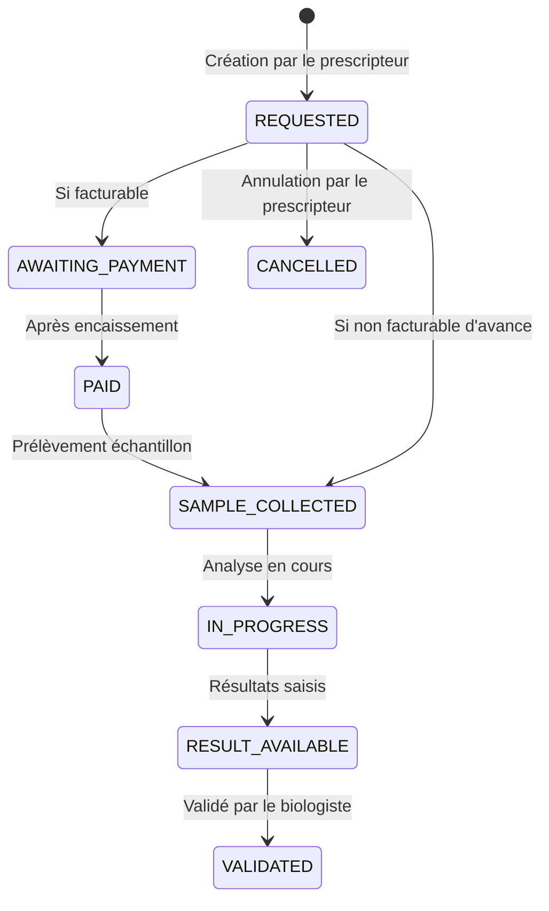

# Spécifications Fonctionnelles : Examens médicaux conformes CDC (STORY-1905)

## 1. Problème métier
Le cahier des charges (CDC) définit des règles strictes sur la gestion des demandes d'examens :
- **Types contrôlés** : Restriction aux examens de type `LABORATOIRE`, `IMAGERIE`, `CARDIOLOGIE`, `ORL`, `OPHTALMOLOGIE`, ou `AUTRE`.
- **Workflow de paiement** : Support de statuts de facturation (`AWAITING_PAYMENT`, `PAID`) pour l'encaissement avant réalisation si nécessaire.
- **Ségrégation d'organisation** : Séparation claire entre l'organisation demanderesse (`source_organization_id`) et le laboratoire/centre exécutant (`target_organization_id`).
- **Structure des examens** : Une demande d'examen porte sur une liste structurée d'analyses ou examens individuels (modèle parent-enfant), éliminant le stockage sous forme de texte CSV simple.
- **Sécurité et Permissions** : Seul le personnel de l'organisation cible (laboratoire) doit pouvoir modifier les statuts d'exécution de la demande.
- **Notification patient** : Visibilité claire pour le patient lorsque des résultats sont disponibles (`RESULT_AVAILABLE`).

## 2. Acteurs & Rôles
- **Médecin / Praticien (Prescripteur)** : Crée la demande d'examen structurée, spécifie le type, la priorité, et l'établissement cible.
- **Biologiste / Technicien (Exécutant)** : Réceptionne les échantillons, met à jour le statut (ex: `SAMPLE_COLLECTED`, `IN_PROGRESS`), saisit et valide les résultats.
- **Patient** : Consulte l'état de ses examens sur son portail et télécharge ses résultats quand ils sont prêts.

## 3. Cycle de vie de la demande d'examen

## 4. Critères d'acceptation
- **Types d'examens** : Validation stricte des types d'examens autorisés.
- **Multi-tenancy et Ségrégation** : Un biologiste d'une clinique A ne peut modifier qu'une demande dont l'organisation cible (`target_organization_id`) correspond à sa propre clinique A.
- **Modèle de données structuré** : Remplacement du champ CSV `exams` par une table fille `lab_order_items`.
- **Notification patient** : Quand une demande passe à `RESULT_AVAILABLE` ou `VALIDATED`, le patient reçoit une notification (selon le module de notifications).
