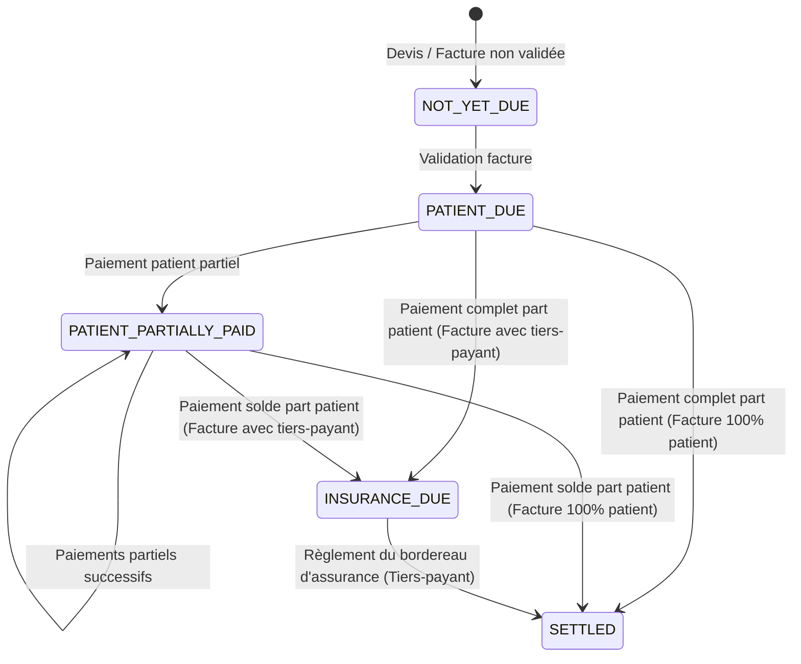

# Validation du modèle d'état financier et des processus métier (DAF)

Ce document formalise les règles de validation financière, les processus comptables et les parcours cibles pour la caisse, le recouvrement et le pilotage DAF (STORY-2112 à STORY-2115).

---

## 1. Modèle d'état financier ventilé (STORY-2112)

Le modèle d'état proposé repose sur un DTO non persistant calculé dynamiquement à partir des créances de chaque facture du patient. 

### États de collection de facture
1. **`NOT_YET_DUE`** (À valider) : La facture est un devis ou n'est pas encore validée par le secrétariat médical.
2. **`PATIENT_DUE`** (Part patient à régler) : La facture est validée. La part patient est impayée.
3. **`PATIENT_PARTIALLY_PAID`** (Part patient partielle) : Le patient a payé une partie de sa part.
4. **`INSURANCE_DUE`** (Assurance à recouvrer) : La part patient est entièrement réglée. La part assurance reste à recouvrer (en attente de facturation sur un bordereau).
5. **`SETTLED`** (Soldée) : Les parts patient et assurance sont entièrement réglées (solde = 0).

### Règle métier de transition (Validation DAF)
- **Validation DAF Actée** : Une facture avec tiers-payant ne peut passer à l'état `SETTLED` qu'après le règlement effectif du bordereau d'assurance. Le statut global de la facture en base (`InvoiceEntity.status`) doit refléter cette ventilation sémantique.

---

## 2. Spécifications du Poste Caissier (STORY-2113)

Le caissier est responsable du flux de trésorerie direct de l'établissement (espèces physiques en caisse).

### A. Flux de session de caisse
- **Ouverture de session** : Déclaration obligatoire d'un fonds de caisse initial (espèces).
- **Mouvements autorisés** :
  - `IN` : Règlements de facture (Espèces, Chèque, Virement/Mobile money). Seuls les encaissements en `CASH` (espèces) augmentent le solde théorique espèces de la caisse.
  - `OUT` : Dépenses de fonctionnement (espèces uniquement). Les dépenses > 100 000 FCFA exigent une double signature (autorisation DAF) et un justificatif physique en GED.
  - `TRANSFER_TO_BANK` : Dépôt d'espèces physiques en banque. Réduit le solde espèces de la caisse. Référence de bordereau de dépôt bancaire obligatoire.
- **Clôture de session** : Le caissier compte sa caisse et saisit le solde espèces physique constaté.
  - **Écart de caisse** : Le système calcule la différence `Écart = Constaté - Théorique`.
  - **Validation d'écart** : Tout écart (déficit ou excédent) doit être justifié par un commentaire obligatoire pour pouvoir clôturer la session.

### B. Validation DAF des Règles d'écart (Arbitrage)
1. **Déficit de caisse (Écart négatif)** : Imputation automatique dans un compte de charge exceptionnelle (`656` selon OHADA). Une retenue sur salaire ou un remboursement immédiat par le caissier est déclenché selon le règlement intérieur de l'établissement.
2. **Excédent de caisse (Écart positif)** : Imputation automatique dans un compte de produit exceptionnel (`756` selon OHADA).

---

## 3. Spécifications du Poste Recouvrement (STORY-2114)

Le chargé de recouvrement gère le suivi des créances tiers-payant (assurances/sociétés) et des restes à payer patients.

### A. Balance Âgée (Aging Balance)
Le système classe les créances dues en 4 catégories basées sur la date d'émission de la facture :
- **Sain (0 - 30 jours)** : Factures récemment émises, en cours de traitement de bordereau.
- **À Relancer (31 - 60 jours)** : Bordereau envoyé mais non réglé. Déclenchement de relance téléphonique.
- **Urgent (61 - 90 jours)** : Deuxième relance formelle (courrier/email).
- **Contentieux (> 90 jours)** : Transfert au service juridique ou provision pour créance douteuse.

### B. Historique des Actions de Relance
Chaque créance dispose d'un journal d'actions :
- Saisie de l'action : Date, Acteur (Chargé de recouvrement), Type d'action (Appel, Courrier, Visite), Statut (En attente, Promesse de paiement, Litige), Commentaire.
- Les créances à l'état `PAID` ou associées à une facture `SETTLED` sont automatiquement retirées de la liste des créances à relancer.

---

## 4. Spécifications du Pilotage DAF et Imputations OHADA (STORY-2115)

La DAF a besoin d'une vision consolidée et d'écritures comptables conformes aux normes OHADA.

### A. Schéma d'imputations comptables cibles
Pour chaque événement financier, les écritures comptables minimales générées (ou exportées au format CSV pour intégration comptable externe) sont les suivantes :

| Événement | Compte Débité | Libellé Débit | Compte Crédité | Libellé Crédit | Type de journal |
|---|---|---|---|---|---|
| **Validation Facture (Part Patient)** | `411100` | Client Patient | `706100` | Prestations médicales | Ventes |
| **Validation Facture (Tiers-Payant)** | `411200` | Client Assurance | `706100` | Prestations médicales | Ventes |
| **Règlement Patient (Caisse)** | `571100` | Caisse Principale | `411100` | Client Patient | Caisse |
| **Versement Banque (Espèces)** | `585000` | Virements internes | `571100` | Caisse Principale | Caisse |
| **Validation Versement (Banque)** | `521100` | Banque | `585000` | Virements internes | Banque |
| **Règlement Assurance (Bordereau)** | `521100` | Banque | `411200` | Client Assurance | Banque |
| **Déficit de Caisse (Clôture)** | `656000` | Pertes sur écarts de caisse | `571100` | Caisse Principale | Caisse |
| **Excédent de Caisse (Clôture)** | `571100` | Caisse Principale | `756000` | Gains sur écarts de caisse | Caisse |

### B. Console de contrôle DAF
Un tableau de bord centralisé permet à la DAF de :
1. Visualiser et clore/valider les sessions de caisse contenant des écarts.
2. Consulter la liste des bordereaux d'assurance émis, envoyés et réglés.
3. Exporter le grand livre comptable minimal (journal des ventes, caisse, banque) sur une période donnée au format standard Excel/CSV.

---

## 5. Arbitrages métier requis de la DAF (Questions à soumettre à l'utilisateur)

Pour finaliser l'implémentation de la STORY-2113 à la STORY-2115, la DAF doit arbitrer sur les points suivants :

1. **Procédure de validation des écarts** : Souhaitez-vous qu'un écart supérieur à un certain seuil (ex: 50 000 FCFA) bloque automatiquement la clôture de la caisse jusqu'à validation par la DAF, ou le caissier peut-il clore la caisse en saisissant simplement sa justification ?
2. **Gestion des chèques rejetés** : Comment imputer le rejet d'un chèque déjà comptabilisé dans une session de caisse clôturée ? Souhaitez-vous un mouvement `OUT` correctif sur la caisse courante, ou la génération d'un avoir ?
3. **Format d'export comptable** : Quel logiciel de comptabilité utilisez-vous en interne (ex: Sage 100, Odoo, SAP) afin d'adapter la structure des colonnes de l'export CSV/Excel ?
