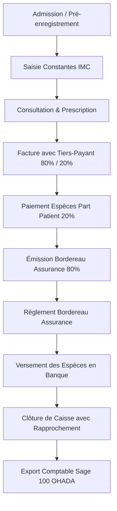

# Spécification Fonctionnelle — STORY-2116 : Tests E2E globaux et Accessibilité

Cette spécification définit le scénario de validation fonctionnelle de bout en bout et les exigences d'accessibilité pour l'ensemble des modules d'intégrité financière développés au cours de l'**EPIC-0018**.

## 1. Scénario E2E Global Nominal (Intégrité Financière)

Le test d'intégration doit valider de bout en bout le flux financier complet suivant :

### Étapes du flux :
1. **Création d'un patient** et admission de sa visite.
2. **Saisie de constantes vitales** pour initialiser le dossier médical.
3. **Consignation de la consultation** par le médecin et prescription d'actes à facturer.
4. **Génération de la facture** par l'agent d'accueil / facturation :
   - Application d'une convention d'assurance (ex: tiers-payant à 80%).
   - Calcul et séparation stricts de la part patient (20%) et de la part assurance (80%).
5. **Règlement de la part patient** (20%) en espèces par le caissier :
   - Émission du reçu numéroté automatique.
   - Synchronisation et réduction de la créance patient opérationnelle.
6. **Regroupement en bordereau d'assurance** (80%) :
   - Sélection de la part assurance de la facture.
   - Émission du bordereau d'assurance.
7. **Règlement du bordereau** :
   - Enregistrement du paiement par virement ou chèque du garant d'assurance.
   - Mise à jour du statut de la facture à `SETTLED`.
8. **Versement en Banque** :
   - Retrait d'espèces de la caisse pour dépôt en banque avec référence de bordereau de dépôt.
9. **Clôture de la session de caisse** :
   - Vérification du solde final en espèces, chèques, et virements.
   - Saisie du solde physique déclaré et calcul de l'écart (justification obligatoire en cas d'écart).
10. **Traitement de l'écart DAF** :
    - Connexion avec le rôle DAF.
    - Saisie de la note de résolution de l'écart et validation.
11. **Exportation comptable** :
    - Génération du fichier CSV Sage 100 OHADA.
    - Vérification des équilibres Débit/Crédit et des imputations sur les comptes corrects (`411100`, `411200`, `571100`, `521100`, `706100`, `585000`).

## 2. Exigences d'Accessibilité (WCAG / Front-end)

L'ensemble des écrans développés pour l'intégrité financière (Console Caissier, Suivi des Créances, Relances, Bordereaux, Console DAF) doit respecter les critères d'accessibilité suivants :

### A. Contraste et Couleurs
- Ratio de contraste minimal de **4.5:1** pour le texte standard et **3:1** pour le texte large.
- Les états (hover, focus, disabled) doivent se distinguer par des contrastes HSL clairs.
- L'information ne doit jamais être véhiculée par la couleur seule (ex: un badge d'écart négatif rouge doit comporter un signe `-` ou un texte descriptif).

### B. Navigation Clavier & Focus
- Tous les éléments interactifs (boutons, liens, champs de saisie, options d'onglets) doivent être accessibles au clavier (touche `Tab`).
- Le focus doit être visible et accentué par un outline propre (ex: `focus:ring-2 focus:ring-brand-cyan`).
- L'ordre de tabulation doit suivre la lecture naturelle de l'écran.

### C. Structure et Sémantique HTML5
- Utilisation de balises sémantiques : `<header>`, `<main>`, `<footer>`, `<section>`, `<nav>`, `<table>`, `<thead>`, `<tbody>`.
- Utilisation d'un seul titre de niveau `<h1>` par page.
- Présence d'attributs `aria-label` descriptifs pour les boutons iconographiques n'ayant pas de texte visible (ex: boutons de suppression ou de téléchargement PDF).
- Liaison explicite des labels et des inputs via l'attribut `for` / `id`.
