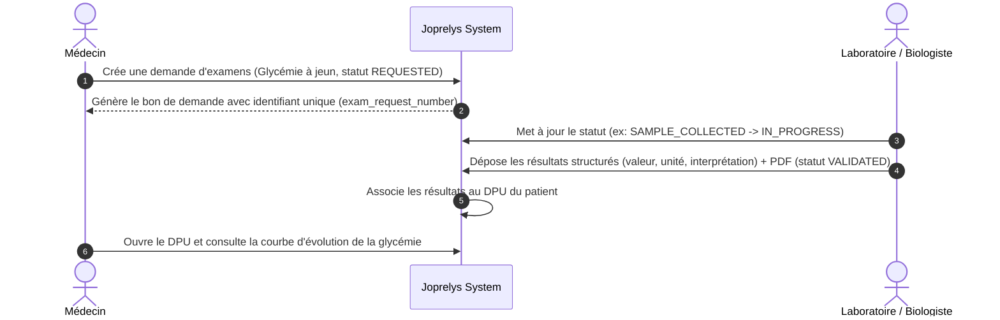

# SPÉCIFICATION FONCTIONNELLE — Intégration Laboratoire & Examens Biologiques (lab-integration)

## 1. Contexte & Problème Métier
Aujourd'hui, les examens de laboratoire prescrits par les médecins sont imprimés sur papier, puis réalisés dans un laboratoire. Le patient doit ensuite ramener le résultat papier lors de sa prochaine visite, ce qui entraîne des pertes, des retards de diagnostic et une absence d'historisation structurée des marqueurs biologiques (comme la glycémie, le cholestérol, l'hémoglobine).

L'objectif du module Laboratoire est d'automatiser le flux :
1. Prescription numérique structurée de la demande d'examen par le médecin.
2. Réception directe et sécurisée des résultats d'analyses transmis par le laboratoire partenaire.
3. Consultation structurée et visuelle (courbes d'évolution) des constantes biologiques directement dans le DPU du patient.
4. Mise à disposition d'un portail laboratoire conforme au Cahier des Charges pour traiter les demandes, saisir et valider les résultats.

---

## 2. Acteurs & Permissions
* **Médecin / Infirmier** :
  - Peut émettre une demande d'examen biologique.
  - Peut consulter l'historique et l'évolution des marqueurs biologiques dans le DPU.
* **Laboratoire Partenaire (API Externe) / Biologiste** :
  - Peut recevoir les demandes d'examens et mettre à jour leur statut.
  - Peut téléverser des résultats d'examens structurés liés à une demande.
  - Doit disposer d'écrans dédiés pour consulter les demandes reçues, ouvrir le détail d'une demande, saisir les résultats, valider et transmettre le PDF.
* **Patient** :
  - Peut visualiser ses résultats et leur interprétation simplifiée sur son Portail Patient.

---

## 3. Périmètre MVP (Module 8 & 9 du Cahier des Charges)
### Inclus
- **Cycle de vie de la demande d'examen** (`exam_request_number`) avec les statuts :
  ```text
  REQUESTED
  AWAITING_PAYMENT
  PAID
  SAMPLE_COLLECTED
  IN_PROGRESS
  RESULT_AVAILABLE
  VALIDATED
  CANCELLED
  ```
- **Structure d'un résultat d'analyses** (`result_number`, `analyte_name`, `value`, `unit`, `reference_range`, `interpretation` (Normal, Bas, Élevé, Critique), `comment`).
- **Stockage et rattachement du PDF** officiel du laboratoire externe.
- **Portail laboratoire CDC** :
  - tableau de bord labo ;
  - demandes reçues ;
  - détail demande ;
  - saisie résultat ;
  - validation résultat ;
  - envoi PDF ;
  - historique résultats.
- **Règles d'accès** :
  - `FR-EXAM-001` : demande d'examen liée obligatoirement à un patient.
  - `FR-EXAM-002` : demande d'examen liée obligatoirement à un médecin demandeur.
  - `FR-EXAM-005` : les résultats validés par le biologiste sont automatiquement injectés dans le DPU du patient.
  - `FR-RESULT-001` : un résultat validé ne peut plus être modifié sans création d'une nouvelle version.

### Exclus (Post-MVP)
- Signature électronique qualifiée des rapports.
- Routage automatique vers des automates de laboratoire spécifiques.
- Alertes par SMS/E-mail automatiques en cas de valeur critique (hors normes).

---

## 3.1 Exigences UI et alignement dashboard patient

Les écrans du portail laboratoire doivent reprendre les décisions visuelles appliquées au dashboard patient :

- conteneur principal plus large pour réduire les espaces gauche/droite inutiles ;
- grille dense et lisible, adaptée aux tableaux opérationnels ;
- couleurs harmonisées avec `DESIGN.md`, sans nouvelle palette isolée ;
- cards et panneaux sobres, rayons de 4px à 6px recommandés et 8px maximum sans ADR ;
- composants Angular partagés pour états loading, empty, error, badges de statut, boutons et tableaux ;
- support light/dark ;
- textes visibles internationalisés en français et anglais.

---

## 4. Parcours Utilisateur Cible



---

## 5. Critères d'acceptation
* Un médecin peut sélectionner un ou plusieurs examens biologiques standards lors de sa consultation.
* La demande génère un code unique (`exam_request_number`) imprimable ou transmissible.
* L'API externe de téléversement refuse les dépôts sans authentification valide du laboratoire.
* L'IHM médecin affiche une alerte si des résultats sont hors des normes cliniques configurées (statuts d'interprétation `ELEVÉ`, `BAS` ou `CRITIQUE`).
* Le portail laboratoire couvre les écrans listés par le Cahier des Charges et ne se limite pas à l'API de téléversement.
