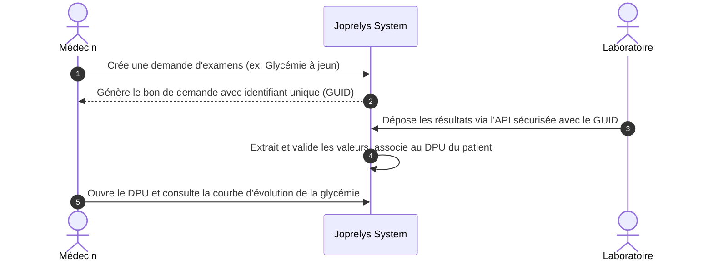

# SPÉCIFICATION FONCTIONNELLE — Intégration Laboratoire & Examens Biologiques (lab-integration)

## 1. Contexte & Problème Métier
Aujourd'hui, les examens de laboratoire prescrits par les médecins sont imprimés sur papier, puis réalisés dans un laboratoire. Le patient doit ensuite ramener le résultat papier lors de sa prochaine visite, ce qui entraîne des pertes, des retards de diagnostic et une absence d'historisation structurée des marqueurs biologiques (comme la glycémie, le cholestérol, l'hémoglobine).

L'objectif du module Laboratoire est d'automatiser le flux :
1. Prescription numérique structurée de l'examen par le médecin.
2. Réception directe et sécurisée des résultats d'analyses transmis par le laboratoire partenaire.
3. Consultation structurée et visuelle (courbes d'évolution) des constantes biologiques directement dans le DPU du patient.

---

## 2. Acteurs & Permissions
* **Médecin / Infirmier** :
  - Peut émettre une demande d'examen biologique.
  - Peut consulter l'historique et l'évolution des marqueurs biologiques dans le DPU.
* **Laboratoire Partenaire (API Externe)** :
  - Peut téléverser des résultats d'examens validés liés à une demande d'examen.
* **Patient** :
  - Peut visualiser ses résultats et leur interprétation simplifiée sur son Portail Patient.

---

## 3. Périmètre MVP
### Inclus
- Formulaire de demande d'examen (choix parmi un catalogue de marqueurs standards : Hémogramme, Glycémie, Bilan rénal, Bilan lipidique).
- API REST sécurisée pour le dépôt automatique des résultats par le laboratoire.
- Stockage du rapport officiel en format PDF.
- Visualisation tabulaire et graphique des résultats dans le DPU (Angular).

### Exclus (Post-MVP)
- Signature électronique qualifiée des rapports.
- Routage automatique vers des automates de laboratoire spécifiques.
- Alertes par SMS/E-mail automatiques en cas de valeur critique (hors normes).

---

## 4. Parcours Utilisateur Cible

---

## 5. Critères d'acceptation
* Un médecin peut sélectionner un ou plusieurs examens biologiques standards lors de sa consultation.
* La demande génère un code unique (GUID) imprimable ou envoyable sur le bon de demande.
* L'API externe de téléversement refuse les dépôts sans authentification valide du laboratoire ou sans GUID de demande valide.
* L'IHM médecin affiche une alerte si des résultats sont hors des normes cliniques configurées.
