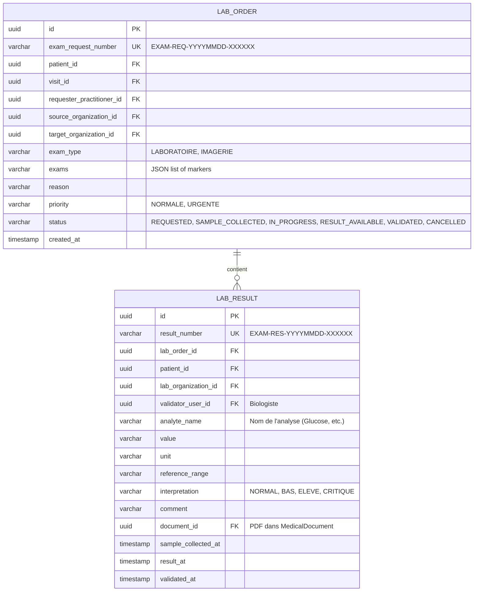

# DESIGN TECHNIQUE — Intégration Laboratoire & Examens Biologiques (lab-integration)

## 1. Architecture & Architecture Cible
L'intégration s'appuiera sur la création de deux entités majeures dans la base de données PostgreSQL :
1. `LabOrderEntity` : Représente la demande d'examens faite par le médecin.
2. `LabResultEntity` : Représente les valeurs de résultats d'analyses reçues du laboratoire externe.

Le système exposera une API sécurisée par authentification JWT avec une clé d'API dédiée aux serveurs du laboratoire partenaire.

Le Cahier des Charges impose également un portail laboratoire. L'implémentation doit donc distinguer :

- **intégration serveur à serveur** : `POST /api/public/lab-integration/upload` par clé d'API ;
- **portail laboratoire Angular** : écrans authentifiés pour tableau de bord, demandes reçues, détail demande, changement de statut, saisie/validation résultat, dépôt PDF et historique.

---

## 2. Modèle de Données (Module 8 & 9)



---

## 3. Contrat d'API

### Demande d'examen (Médecin)
`POST /api/lab-orders`
* Requête :
```json
{
  "patientId": "3fa85f64-5717-4562-b3fc-2c963f66afa6",
  "visitId": "2fa85f64-5717-4562-b3fc-2c963f66afa6",
  "targetOrganizationId": "5fa85f64-5717-4562-b3fc-2c963f66afa6",
  "examType": "LABORATOIRE",
  "exams": ["NFS", "GLYSEMIE_A_JEUN", "CHOLESTEROL"],
  "reason": "Suspicion de diabète",
  "priority": "NORMALE"
}
```

### Liste des demandes reçues
`GET /api/lab-orders`

Retourne les demandes d'examens du tenant courant pour alimenter le portail laboratoire MVP.

### Changement de statut laboratoire
`PATCH /api/lab-orders/{id}/status`

```json
{
  "status": "IN_PROGRESS"
}
```

Statuts autorisés :

```text
REQUESTED
SAMPLE_COLLECTED
IN_PROGRESS
RESULT_AVAILABLE
VALIDATED
CANCELLED
```

### Dépôt de résultats (Laboratoire)
`POST /api/public/lab-integration/upload`
* Headers : `X-API-KEY: lab-partner-secret-token`
* Requête :
```json
{
  "examRequestNumber": "EXAM-REQ-20260703-000042",
  "validatorName": "Dr. Jean Kamdem",
  "sampleCollectedAt": "2026-07-03T07:30:00Z",
  "resultAt": "2026-07-03T10:00:00Z",
  "validatedAt": "2026-07-03T10:15:00Z",
  "conclusion": "Bilan glycémique élevé à contrôler",
  "results": [
    {
      "analyteName": "Glucose à jeun",
      "value": "1.45",
      "unit": "g/L",
      "referenceRange": "0.70 - 1.10",
      "interpretation": "ELEVE",
      "comment": "Patient à jeun depuis 12h"
    }
  ],
  "pdfBase64": "JVBERi0xLjQK..."
}
```

---

## 4. Sécurité & Contrôle d'Accès
- **Édition / Consultation** : Rôles `MEDECIN` and `ADMIN_CLINIQUE` requis sur les routes `/api/lab-orders/**`.
- **Dépôt externe** : Authentification par clé d'API (API Key) validée par un filtre Spring Security spécifique (`ApiKeyAuthenticationFilter`), avec limitation de débit (rate limiting) pour éviter les attaques par déni de service.
- **Portail laboratoire** : rôle laboratoire/biologiste à confirmer (`BIOLOGISTE`, `LABORATOIRE` ou extension contrôlée du RBAC existant). Le MVP utilise le fallback sécurisé `MEDECIN` / `ADMIN_CLINIQUE`. Les écrans ne doivent exposer que les données nécessaires au traitement de la demande, pas le DPU complet.
- **Transitions de statut** : le backend reste maître des transitions autorisées. Angular affiche les actions disponibles, mais ne décide jamais seul de la validité métier.

---

## 4.1 Architecture UI portail laboratoire

Routes cibles à valider :

```text
/clinic/lab-orders
```

Structure Angular recommandée :

```text
web/src/app/lab/
  lab.routes.ts
  pages/
    lab-dashboard-page.component.ts
    lab-order-detail-page.component.ts
    lab-result-entry-page.component.ts
  components/
    lab-order-table.component.ts
    lab-order-status-badge.component.ts
    lab-result-lines.component.ts
  services/
    lab-portal-api.service.ts
  models/
    lab-portal.models.ts
```

Les composants pages orchestrent les appels API et les composants de présentation restent réutilisables. Les appels HTTP passent par des chemins relatifs `/api/...`.

### Référence visuelle

Les écrans doivent reprendre l'approche du dashboard patient :

- conteneur desktop large pour réduire les marges gauche/droite ;
- tableaux et listes denses, scannables ;
- surfaces sobres alignées sur `DESIGN.md` ;
- pas d'Angular Material ;
- Tailwind CSS v4 CSS-first ;
- i18n FR/EN et light/dark obligatoires.

---

## 5. Stratégie de Tests
* **Tests Backend** :
  - `LabOrderServiceTest` : Validation des règles de transition d'état d'une demande.
  - `LabIntegrationControllerTest` : Validation de l'authentification X-API-KEY et des formats de payload.
* **Tests Frontend** :
  - `lab-results-timeline.component.spec.ts` : Validation de l'affichage correct des courbes d'évolution des marqueurs.
  - `lab-dashboard-page.component.spec.ts` : liste des demandes, filtres, états vide/erreur.
  - `lab-order-detail-page.component.spec.ts` : affichage du détail et actions de statut.
  - `lab-result-entry-page.component.spec.ts` : saisie, validation résultat et upload PDF.
