# DESIGN TECHNIQUE — Intégration Laboratoire & Examens Biologiques (lab-integration)

## 1. Architecture & Architecture Cible
L'intégration s'appuiera sur la création de deux entités majeures dans la base de données PostgreSQL :
1. `LabOrderEntity` : Représente la demande d'examens faite par le médecin.
2. `LabResultEntity` : Représente les valeurs de résultats d'analyses reçues du laboratoire externe.

Le système exposera une API sécurisée par authentification JWT avec une clé d'API dédiée aux serveurs du laboratoire partenaire.

---

## 2. Modèle de Données (DATA-MODEL.md conceptuel)

```mermaid
erDiagram
    LAB_ORDER {
        uuid id PK
        uuid patient_id FK
        uuid visit_id FK
        varchar status "PENDING, FULFILLED, CANCELLED"
        timestamp requested_at
        varchar requested_by
    }
    LAB_RESULT {
        uuid id PK
        uuid lab_order_id FK
        varchar marker_code "GLUCOSE, CHOLESTEROL, etc."
        varchar value
        varchar unit
        varchar reference_range
        boolean is_abnormal
        timestamp performed_at
    }
    LAB_ORDER ||--o{ LAB_RESULT : "contient"
```



---

## 3. Contrat d'API (API-CONTRACT.md conceptuel)

### Demande d'examen (Médecin)
`POST /api/lab-orders`
* Requête :
```json
{
  "patientId": "3fa85f64-5717-4562-b3fc-2c963f66afa6",
  "visitId": "2fa85f64-5717-4562-b3fc-2c963f66afa6",
  "markers": ["GLUCOSE_FASTING", "LIPID_PANEL"]
}
```

### Dépôt de résultats (Laboratoire)
`POST /api/public/lab-integration/upload`
* Headers : `X-API-KEY: lab-partner-secret-token`
* Requête :
```json
{
  "labOrderId": "1fa85f64-5717-4562-b3fc-2c963f66afa6",
  "performedAt": "2026-07-03T10:00:00Z",
  "results": [
    {
      "markerCode": "GLUCOSE_FASTING",
      "value": "1.12",
      "unit": "g/L",
      "referenceRange": "0.70 - 1.10",
      "isAbnormal": true
    }
  ],
  "pdfBase64": "JVBERi0xLjQK..."
}
```

---

## 4. Sécurité & Contrôle d'Accès
- **Édition / Consultation** : Rôles `MEDECIN` et `ADMIN_CLINIQUE` requis sur les routes `/api/lab-orders/**`.
- **Dépôt externe** : Authentification par clé d'API (API Key) validée par un filtre Spring Security spécifique (`ApiKeyAuthenticationFilter`), avec limitation de débit (rate limiting) pour éviter les attaques par déni de service.

---

## 5. Stratégie de Tests
* **Tests Backend** :
  - `LabOrderServiceTest` : Validation des règles de transition d'état d'une demande.
  - `LabIntegrationControllerTest` : Validation de l'authentification X-API-KEY et des formats de payload.
* **Tests Frontend** :
  - `lab-results-timeline.component.spec.ts` : Validation de l'affichage correct des courbes d'évolution des marqueurs.
