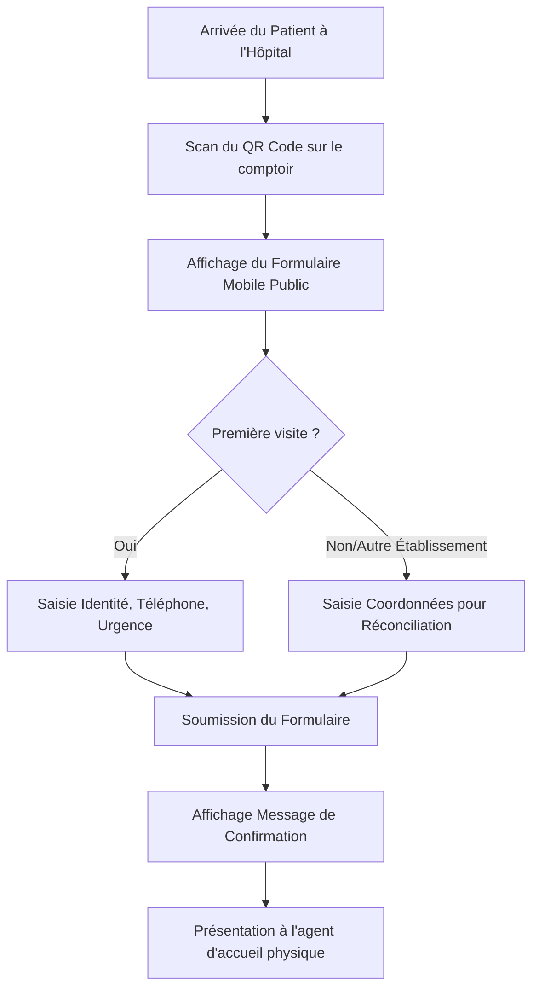
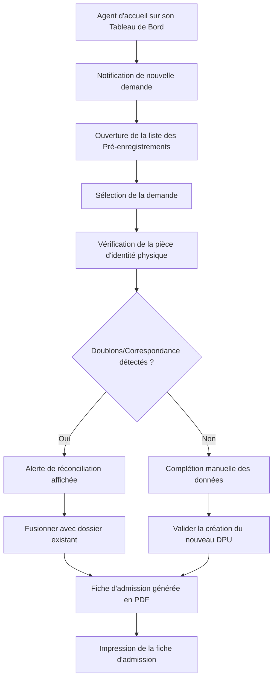

# Spécification Fonctionnelle — Enregistrement patient en autonomie (Self-Registration) via QR Code

## 1. Introduction & Contexte

Le processus d'admission traditionnel dans les cliniques et hôpitaux est souvent source de goulots d'étranglement à l'accueil. L'agent d'accueil doit saisir manuellement toutes les informations de base des patients à leur arrivée.

Cette fonctionnalité introduit la possibilité pour un patient d'initier son enregistrement en scannant un QR Code physique affiché sur le comptoir d'admission de l'établissement. Ce QR Code le redirige vers un formulaire web public optimisé pour smartphone où il peut saisir ses informations d'identité, de contact et ses antécédents de base.

L'agent d'accueil reçoit cette demande en temps réel dans son back-office et procède à la validation physique et administrative du dossier avant son intégration officielle dans le Dossier Patient Unique (DPU).

---

## 2. Acteurs & Rôles

- **Patient** : Scanne le QR Code et saisit ses informations personnelles en autonomie sur son smartphone.
- **Agent d'accueil / Secrétaire médicale** : Reçoit, examine, complète, valide ou rejette les demandes de pré-enregistrement dans l'application.
- **Administrateur Clinique** : Configure le QR Code de l'organisation et accède aux statistiques d'utilisation.

---

## 3. Parcours Utilisateur & Workflows

### 3.1. Parcours du Patient (Formulaire Public Mobile)

1. **Scan du QR Code** : Le patient scanne le QR code physique. Celui-ci contient une URL contenant l'identifiant de l'établissement (tenantId).
2. **Formulaire mobile public** :
   - Sélection du parcours : "Nouvelle fiche patient" ou "Déjà venu / Autre hôpital".
   - Si "Déjà venu / Autre hôpital", le patient renseigne ses critères de recherche (Nom, Prénom, Téléphone, Date de naissance). *Note de sécurité : aucune information confidentielle n'est renvoyée au patient sur son smartphone.*
   - Si "Nouvelle fiche patient", le patient complète :
     - Identité : Nom, Prénom, Genre, Date de naissance, Groupe Sanguin (optionnel).
     - Coordonnées : Téléphone (optionnel), Email (optionnel), Adresse.
     - Contact d'urgence : Nom, Téléphone, Relation.
3. **Soumission** : Le patient valide. Un message s'affiche : *"Vos données ont bien été transmises. Veuillez vous présenter au comptoir d'admission."*

### 3.2. Parcours de l'Agent d'accueil (Back-office Authentifié)

1. **Réception de la notification** : Un indicateur visuel (badge avec le nombre de demandes en attente) s'affiche sur le menu "Admissions" de l'agent d'accueil.
2. **Examen de la demande** :
   - L'agent ouvre l'écran de gestion des pré-enregistrements.
   - Les informations saisies par le patient sont affichées dans une vue comparative.
3. **Vérification & Correction** :
   - L'agent d'accueil demande la pièce d'identité physique du patient pour vérifier l'exactitude des informations (orthographe, date de naissance).
   - L'agent peut éditer les champs directement s'il y a des erreurs de saisie.
4. **Réconciliation ou Création** :
   - **Cas A : Nouveau Patient** : L'agent clique sur "Valider & Créer DPU". Le patient est créé dans la table `patients`.
   - **Cas B : Patient Existant (Réconciliation)** : Le système alerte l'agent qu'un dossier similaire existe déjà (score de similarité Levenshtein). L'agent peut choisir de fusionner les nouvelles données avec le DPU existant.
5. **Impression de la fiche d'admission** : L'agent clique sur "Imprimer la fiche d'admission". Un document PDF standardisé est généré avec un QR Code de visite pour le parcours de soins interne.

---

## 4. Règles Métier & Sécurité

- **FR-QR-001 (Inclusion)** : La création manuelle traditionnelle d'un patient par l'agent d'accueil doit toujours rester disponible et prioritaire si nécessaire.
- **FR-QR-002 (Staging Area)** : Les formulaires soumis par le public ne doivent jamais écrire directement dans la table des patients actifs. Ils restent dans une table de transition à l'état `AWAITING_VALIDATION`.
- **FR-QR-003 (Confidentialité PII)** : Le formulaire mobile public ne doit divulguer aucune donnée personnelle de patients existants. Aucun endpoint public ne doit renvoyer de données patient sans authentification forte.
- **FR-QR-004 (Durée de vie)** : Les demandes de pré-enregistrement en attente non validées après 24 heures sont automatiquement purgées de la base de données.
- **FR-QR-005 (Réconciliation interopérabilité)** : Si le patient indique venir d'un autre hôpital partenaire, la recherche s'effectue via l'interopérabilité (FHIR/HL7) par le back-office uniquement au moment de la validation par l'agent d'accueil.
- **FR-QR-006 (Impression)** : La fiche d'admission générée après validation doit contenir le nom de la clinique, le logo, les informations d'identité, les constantes du tri initial si saisies, et le code barre/QR code de la visite courante.
