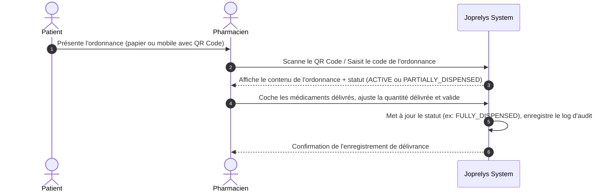

# SPÉCIFICATION FONCTIONNELLE — Dispensation en Pharmacie & Gestion des Prescriptions (pharmacy-dispensation)

## 1. Contexte & Problème Métier
Aujourd'hui, une fois l'ordonnance générée et imprimée par le médecin, il n'y a aucun suivi de sa délivrance. Le patient peut théoriquement imprimer le PDF plusieurs fois et se faire servir dans plusieurs pharmacies différentes, ou bien la pharmacie n'a aucun moyen de vérifier que l'ordonnance n'a pas été révoquée ou déjà servie.

Le module Pharmacie vise à :
1. Permettre à une pharmacie externe partenaire d'accéder de manière sécurisée et contrôlée aux détails d'une prescription active.
2. Enregistrer l'acte de délivrance (dispensation) des médicaments en temps réel.
3. Mettre à jour l'état de l'ordonnance pour éviter la double dispensation (sécurité sanitaire).
4. Fournir un portail pharmacie conforme au Cahier des Charges pour vérifier l'ordonnance, consulter le détail, enregistrer la délivrance et consulter l'historique.

---

## 2. Acteurs & Permissions
* **Pharmacien Externe (Partenaire) / Rôle `PHARMACIEN`** :
  - Peut scanner le QR code de l'ordonnance (ou saisir son ID unique).
  - Peut lire les détails de l'ordonnance (médicaments, dosages).
  - Peut enregistrer la délivrance totale ou partielle des médicaments.
* **Médecin / Infirmier** :
  - Peut suivre l'état de délivrance des ordonnances qu'il a prescrites directement dans le DPU du patient.
* **Patient** :
  - Peut voir le statut de son ordonnance (ex: "Délivrée le 03/07/2026 à la Pharmacie du Centre") sur son Portail Patient.

---

## 3. Périmètre MVP (Module 7 du Cahier des Charges)
### Inclus
- **Cycle de vie de l'ordonnance** (`prescription_number`) avec les statuts :
  ```text
  DRAFT
  ACTIVE
  PARTIALLY_DISPENSED
  FULLY_DISPENSED
  EXPIRED
  CANCELLED
  ```
- **Structure d'un médicament prescrit** (`name`, `dosage`, `form`, `route`, `frequency`, `duration`, `quantity`, `instructions`, `substitution_allowed` (boolean)).
- **Délivrance structurée** (suivi de la quantité effectivement dispensée versus la quantité prescrite).
- **Portail pharmacie CDC** :
  - vérification ordonnance ;
  - détail ordonnance ;
  - disponibilité médicaments ;
  - délivrance partielle / totale ;
  - historique délivrances.
- **Règles d'accès** :
  - `FR-PRESC-001` : l'ordonnance doit posséder un numéro unique globale.
  - `FR-PRESC-002` : l'ordonnance doit être vérifiable via QR Code.
  - `FR-PRESC-003` : une ordonnance annulée ou révoquée doit rester visible avec son statut annulé.
  - `FR-PRESC-004` : le pharmacien externe ne voit que les données indispensables à la délivrance (identité patient minimale, prescripteur, médicaments, et non tout le dossier patient).
  - `FR-PRESC-005` : exposition d'API d'ordonnances ouverte (par exemple pour raccordement direct avec AllôPharma).

### Exclus (Post-MVP)
- Liaison directe avec les logiciels de gestion d'officine (LGO) propriétaires.
- Gestion des stocks de pharmacie interne à la clinique.

La disponibilité des médicaments est traitée comme une information déclarative dans le portail pharmacie MVP. Elle ne doit pas introduire un module de stock officinal complet sans nouveau cadrage.

---

## 3.1 Exigences UI et alignement dashboard patient

Les écrans pharmacie doivent reprendre les améliorations du dashboard patient :

- conteneur principal plus large, avec espaces gauche/droite réduits ;
- affichage dense mais lisible des ordonnances et lignes de médicaments ;
- couleurs harmonisées avec `DESIGN.md` et les vues patient ;
- panneaux et cards sobres, rayons de 4px à 6px recommandés et 8px maximum sans ADR ;
- composants Angular partagés pour boutons, champs, badges, états loading/empty/error ;
- support light/dark ;
- textes visibles internationalisés en français et anglais.

---

## 4. Parcours Utilisateur Cible



---

## 5. Critères d'acceptation
* Le pharmacien ne peut accéder aux détails de l'ordonnance que si celle-ci est active (non révoquée, non expirée).
* Si une ordonnance a déjà été marquée comme entièrement dispensée (`FULLY_DISPENSED`), le système affiche un avertissement rouge bloquant interdisant toute nouvelle délivrance.
* En cas de dispensation partielle (`PARTIALLY_DISPENSED`), les médicaments non servis restent disponibles pour une délivrance ultérieure (durant la période de validité de l'ordonnance).
* Le portail pharmacie couvre les écrans listés par le Cahier des Charges et ne se limite pas aux endpoints publics.
