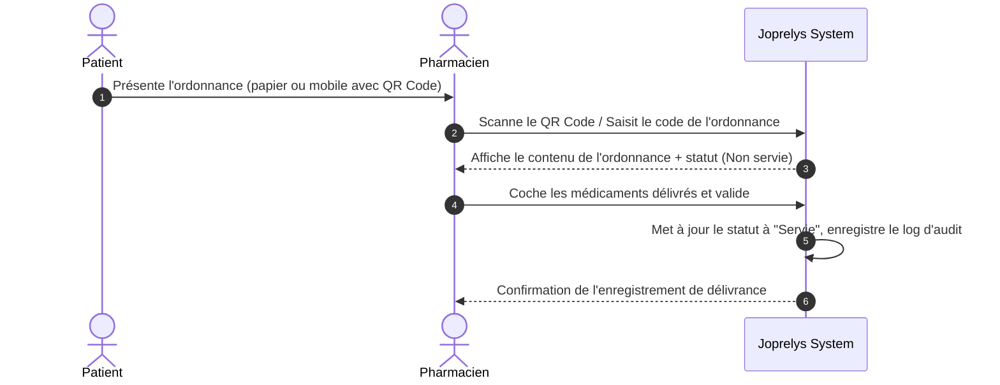

# SPÉCIFICATION FONCTIONNELLE — Dispensation en Pharmacie & Gestion des Prescriptions (pharmacy-dispensation)

## 1. Contexte & Problème Métier
Aujourd'hui, une fois l'ordonnance générée et imprimée par le médecin, il n'y a aucun suivi de sa délivrance. Le patient peut théoriquement imprimer le PDF plusieurs fois et se faire servir dans plusieurs pharmacies différentes, ou bien la pharmacie n'a aucun moyen de vérifier que l'ordonnance n'a pas été révoquée ou déjà servie.

Le module Pharmacie vise à :
1. Permettre à une pharmacie externe partenaire d'accéder de manière sécurisée et contrôlée aux détails d'une prescription active.
2. Enregistrer l'acte de délivrance (dispensation) des médicaments en temps réel.
3. Mettre à jour l'état de l'ordonnance pour éviter la double dispensation (sécurité sanitaire).

---

## 2. Acteurs & Permissions
* **Pharmacien Externe (Partenaire)** :
  - Peut scanner le QR code de l'ordonnance (ou saisir son ID unique).
  - Peut lire les détails de l'ordonnance (médicaments, dosages).
  - Peut enregistrer la délivrance totale ou partielle des médicaments.
* **Médecin / Infirmier** :
  - Peut suivre l'état de délivrance des ordonnances qu'il a prescrites directement dans le DPU du patient.
* **Patient** :
  - Peut voir le statut de son ordonnance (ex: "Délivrée le 03/07/2026 à la Pharmacie du Centre") sur son Portail Patient.

---

## 3. Périmètre MVP
### Inclus
- Portail d'accès sécurisé pour les pharmaciens à l'aide d'un code OTP ou jeton unique imprimé sur l'ordonnance.
- Écran de validation de délivrance : coche des médicaments effectivement donnés au patient, avec gestion des substitutions de génériques.
- Mise à jour du statut global de l'ordonnance (`ACTIVE`, `SERVED` (Servie), `PARTIALLY_SERVED` (Partiellement servie), `EXPIRED`).
- Tracabilité complète de l'accès (qui a consulté, quelle pharmacie, à quelle heure).

### Exclus (Post-MVP)
- Liaison directe avec les logiciels de gestion d'officine (LGO) propriétaires.
- Gestion des stocks de pharmacie interne à la clinique.

---

## 4. Parcours Utilisateur Cible

---

## 5. Critères d'acceptation
* Le pharmacien ne peut accéder aux détails de l'ordonnance que si celle-ci est active (non révoquée, non expirée).
* Si une ordonnance a déjà été marquée comme entièrement servie (`SERVED`), le système affiche un avertissement rouge bloquant interdisant toute nouvelle délivrance.
* En cas de dispensation partielle, les médicaments non servis restent disponibles pour une délivrance ultérieure (durant la période de validité de l'ordonnance).
