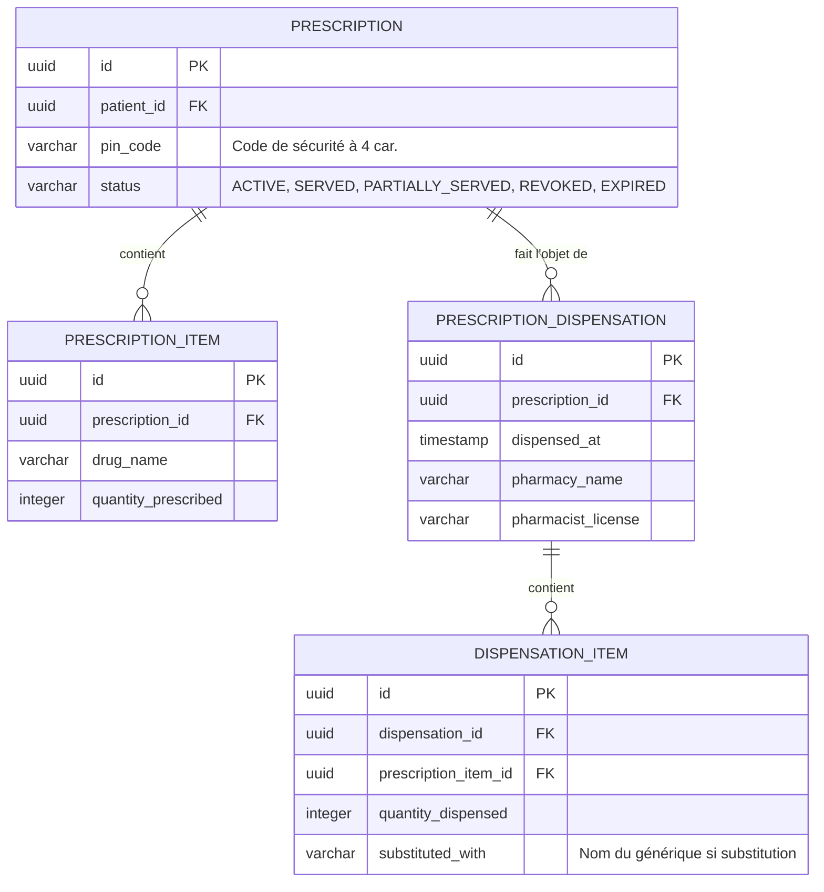

# DESIGN TECHNIQUE — Dispensation en Pharmacie & Gestion des Prescriptions (pharmacy-dispensation)

## 1. Architecture & Architecture Cible
L'accès pharmacien s'effectuera via un espace dédié et sécurisé : `/pharmacy/prescriptions/{id}`.
Pour éviter de requérir un compte utilisateur nominatif lourd à créer pour chaque pharmacie de la ville, l'authentification se fera par double facteur simple :
1. L'identifiant de la prescription (GUID extrait du QR Code).
2. Un code d'accès de sécurité à 4 caractères (PIN unique, imprimé en clair sur l'ordonnance ou envoyé au patient, par exemple `PIN: 8F2A`).

L'état de la dispensation sera stocké dans une nouvelle table de jointure et de suivi `PrescriptionDispensationEntity`.

---

## 2. Modèle de Données (DATA-MODEL.md conceptuel)



---

## 3. Contrat d'API (API-CONTRACT.md conceptuel)

### Récupération de l'ordonnance par le pharmacien
`POST /api/public/pharmacy/prescriptions/verify`
* Requête :
```json
{
  "prescriptionId": "4fa85f64-5717-4562-b3fc-2c963f66afa6",
  "pinCode": "8F2A"
}
```
* Réponse :
```json
{
  "prescriptionId": "4fa85f64-5717-4562-b3fc-2c963f66afa6",
  "status": "ACTIVE",
  "patientName": "Jean Dupont",
  "doctorName": "Dr. Martin",
  "createdAt": "2026-07-03T09:00:00Z",
  "items": [
    {
      "itemId": "5fa85f64-5717-4562-b3fc-2c963f66afa6",
      "drugName": "Amoxicilline 500mg",
      "quantityPrescribed": 3,
      "quantityAlreadyDispensed": 0
    }
  ]
}
```

### Validation de la délivrance
`POST /api/public/pharmacy/prescriptions/dispense`
* Requête :
```json
{
  "prescriptionId": "4fa85f64-5717-4562-b3fc-2c963f66afa6",
  "pinCode": "8F2A",
  "pharmacyName": "Pharmacie du Grand Marché",
  "pharmacistLicense": "PH-987654",
  "dispensedItems": [
    {
      "prescriptionItemId": "5fa85f64-5717-4562-b3fc-2c963f66afa6",
      "quantityDispensed": 3,
      "substitutedWith": null
    }
  ]
}
```

---

## 4. Sécurité & Audit Logs
- **Limitation d'accès** : Toute tentative de brute-force du `pinCode` sur un ID d'ordonnance donné est bloquée après 3 tentatives infructueuses (bannissement d'IP temporaire sur ce endpoint).
- **Traçabilité** : Chaque appel aux endpoints de vérification et de dispensation génère un log d'audit structuré dans la table `audit_logs` avec l'action `PHARMACY_VERIFIED` ou `PHARMACY_DISPENSED`.

---

## 5. Stratégie de Tests
* **Tests unitaires et d'intégration** :
  - Validation de la logique de calcul de statut de l'ordonnance (`ACTIVE` -> `PARTIALLY_SERVED` -> `SERVED`).
  - Validation du blocage de brute-force du code PIN.
  - Validation du calcul de quantité restante autorisée à la délivrance.
