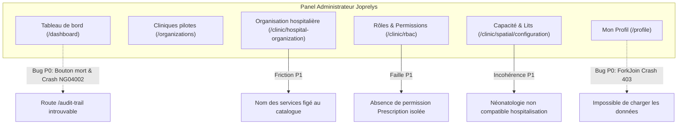
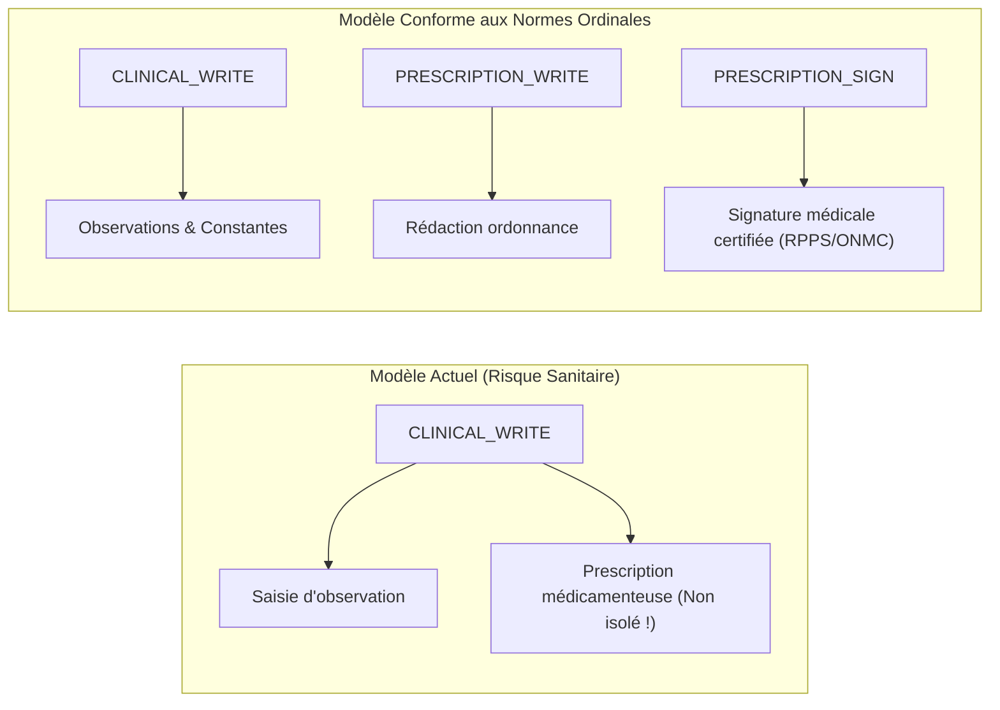

# Rapport d'Audit Clinique, Ergonomique et Réglementaire du Panel Administrateur Joprelys

> **Document de Référence d'Ingénierie & Qualité Médicale**  
> **Auteur :** Médecin Praticien & Expert International en Informatique Médicale / Systèmes d'Information Hospitaliers (SIH)  
> **Date :** 4 Octobre 2026  
> **Cible :** Joprelys HealthTech — Plateforme Recette (`recette.joprelys.com`)  
> **Compte audité :** `jocelin.fomekong@joprelys.com` (Rôle : `ADMIN_JOPRELYS`)

---

## 1. Synthèse Exécutive et Cadre de Référence

Sollicité en qualité de praticien clinicien rompu aux déploiements de dossiers patients informatisés (DPI) et aux exigences de certification hospitalière (HAS, JCI, standards HL7 FHIR), cet audit a pour mission d'éprouver le socle administrateur de **Joprelys Connect**.

### Le Bilan Global
L'architecture logicielle démontre une réelle maturité d'intention :
- Respect de la distinction internationale entre **localisation spatiale** (`Location`) et **structure médico-administrative** (`Organization`).
- Culture de sécurité des soins visible dans certaines granularités RBAC (ex: dissociation entre la décision médicale de sortie et le départ physique du lit).

Néanmoins, l'audit met en lumière des **incohérences cliniques pénalisantes**, des **angles morts médico-légaux majeurs**, ainsi que **deux anomalies techniques bloquantes (P0)** qui paralysent l'expérience administrateur.



---

## 2. Audit de l'Organisation Hospitalière (`/clinic/hospital-organization`)

### 2.1. Les Points Forts
1. **Découplage Spatial vs Organisationnel :** Le sous-titre de l'interface résume parfaitement le standard FHIR : *« Structurez les pôles, départements, services et unités de soins sans confondre organisation et localisation »*. Un service médical peut disposer de lits répartis sur plusieurs étages sans compromettre la logique fonctionnelle.
2. **Hiérarchie à 4 niveaux souple :**
   $$\text{Pôle} \longrightarrow \text{Département} \longrightarrow \text{Service} \longrightarrow \text{Unité de soins}$$
   Le fait que les niveaux supérieurs soient optionnels permet d'équiper aussi bien un cabinet de groupe qu'un Centre Hospitalier Universitaire (CHU).

### 2.2. Incohérences et Limites Majeures

#### 🔴 1. Blocage architectural sur le nom des Services (`name: null`)
Dans le composant `HospitalOrganizationPageComponent` (`chunk-CXAM2tyF.js`), la méthode `submit()` force `name: null` pour tout type `SERVICE` :
```javascript
let e = {
  code: t.code.trim(),
  unitType: t.unitType,
  parentId: t.parentId || null,
  name: t.unitType === "SERVICE" ? null : t.name.trim(),
  serviceCatalogCode: t.unitType === "SERVICE" ? t.serviceCatalogCode : null
};
```
* **Impact Clinique Réel :** Dans un hôpital de taille moyenne à grande, il existe fréquemment des services dédoublés (ex: *Chirurgie Aseptique* vs *Chirurgie Septique*, *Chirurgie Viscérale* vs *Chirurgie Orthopédique*). Ne proposer que le code générique `GENERAL_SURGERY` sans possibilité de personnaliser l'intitulé interdit la création de plusieurs services d'une même discipline.
* **Correction recommandée :** Rendre le `serviceCatalogCode` obligatoire (clé d'interopérabilité), mais **autoriser un champ complémentaire `name` éditable** pour individualiser le service.

#### 🔴 2. Asymétrie et Lacunes Critiques entre Catalogues (Services vs Spécialités)
L'interrogation des endpoints `/api/hospital-organization/catalogs/services` et `/specialties` révèle un décalage flagrant :

| Domaine Médical | Présent dans Services (14) ? | Présent dans Spécialités (10) ? | Diagnostic Clinique |
| :--- | :---: | :---: | :--- |
| **Urgences** | ✅ `EMERGENCY` | ❌ **ABSENT** | **Incohérence majeure :** Un médecin urgentiste ne peut pas renseigner sa spécialité d'urgentiste ! |
| **Traumatologie / Orthopédie** | ❌ **ABSENT** | ❌ **ABSENT** | Incompréhensible en Afrique subsaharienne où l'accidentologie routière représente un volume d'admissions critique. |
| **Néonatologie** | ❌ **ABSENT** | ❌ **ABSENT** | Impossible de distinguer la pédiatrie générale des soins intensifs néonataux. |
| **Infectiologie** | ❌ **ABSENT** | ❌ **ABSENT** | Indispensable pour la gestion du paludisme grave, tuberculose, VIH, fièvres hémorragiques. |
| **Gastro-entérologie / Endoscopie** | ❌ **ABSENT** | ❌ **ABSENT** | Absence de filière digestive médicale. |
| **Ophtalmologie / ORL / Stomatologie** | ❌ **ABSENT** | ❌ **ABSENT** | Activités de consultation externe et ambulatoire totalement oubliées. |
| **Néphrologie / Hémodialyse** | ❌ **ABSENT** | ❌ **ABSENT** | Manque critique pour les centres d'hémodialyse. |

#### 🟠 3. Absence de Gouvernance sur l'Unité de Soins
Le modèle actuel ne permet pas d'associer :
- Le **Praticien Responsable / Chef de Service** (responsabilité médico-légale des protocoles et prescriptions).
- Le **Cadre de Santé / Infirmier Major** (gestion logistique, dotation soignante et armoire à pharmacie de service).

---

## 3. Audit des Rôles et Permissions (RBAC) (`/clinic/rbac`)

L'API déploie **56 permissions réparties en 16 domaines**.

### 3.1. Les Points Remarquables (Excellence Clinique)
> [!TIP]
> **Découplage de la sortie d'hospitalisation :**  
> `HOSPITALIZATION_DISCHARGE_DECIDE` (médecin validant le diagnostic et le traitement de sortie) est séparé de `HOSPITALIZATION_PHYSICAL_DEPARTURE_CONFIRM` (soignant constatant la libération effective du lit). Cette dissociation élimine le syndrome classique du "lit fantôme libéré trop tôt".

- **Traçabilité de l'administration du médicament :** `HOSPITALIZATION_MEDICATION_ADMINISTER` trace la prise sans donner le pouvoir de prescrire.
- **Bris de glace d'urgence :** `PATIENT_EMERGENCY_ACCESS` offre un accès dérogatoire et audité au dossier en situation d'urgence vitale.
- **Identitovigilance :** `PATIENT_MERGE` sécurise la fusion de doublons d'identités.
- **Chaîne de possession médico-légale :** `EMERGENCY_BELONGINGS_WRITE` pour la traçabilité des scellés et valeurs des patients comateux ou blessés.

### 3.2. Failles Médico-Légales et Manques Critiques



#### 🔴 1. Absence d'une permission de Prescription Médicale dédiée
* **Faiblesse :** Dans le domaine `CLINIQUE`, seule la permission `CLINICAL_WRITE` est proposée.
* **Risque Médico-Légal :** La prescription de médicaments et stupéfiants est un **acte médical réservé aux docteurs en médecine**. Un profil soignant ayant besoin de `CLINICAL_WRITE` pour noter une transmission ne doit en aucun cas pouvoir ordonner une prescription.
* **Recommandation :** Créer `PRESCRIPTION_WRITE` et `PRESCRIPTION_SIGN`.

#### 🔴 2. Circuit du Médicament incomplet en Pharmacie
* **Faiblesse :** Le domaine `PHARMACIE` ne contient que `PHARMACY_PRESCRIPTION_READ` et `PHARMACY_STOCK_MANAGE`.
* **Risque Sanitaire :** Il n'existe **aucune permission pour la validation pharmaceutique** (détection des interactions, surdosages, contre-indications) ni pour la **dispensation / délivrance effective** (`PHARMACY_DISPENSE`).

#### 🟠 3. Verrouillage et Signature des Actes Médicaux
* **Faiblesse :** Absence de `CLINICAL_SIGN` ou `CONSULTATION_LOCK`. Un compte-rendu médical validé doit être scellé de manière inaltérable (avec horodatage certifié).

---

## 4. Audit de la Capacité d'Accueil et Topographie (`/clinic/spatial`)

L'architecture spatiale s'appuie sur le modèle hiérarchique :
$$\text{SITE} \longrightarrow \text{BUILDING} \longrightarrow \text{FLOOR} \longrightarrow \text{ZONE}$$

### Aberrations Identifiées sur les Types d'Espaces (`spaceTypes`)

> [!CAUTION]
> **Néonatologie non compatible hospitalisation :**  
> Dans `/api/spatial/configuration/space-types`, le type `NEONATAL_ROOM` possède l'indicateur :
> ```json
> { "code": "NEONATAL_ROOM", "inpatientCompatible": false }
> ```
> C'est une **aberration clinique directe**. Un nouveau-né sous couveuse ou photothérapie en néonatologie est un patient hospitalisé à part entière. Ce paramètre interdit techniquement d'y admettre un patient.

- **Box des Urgences (`EMERGENCY_BOX`) :** Également marqué `inpatientCompatible: false`. Cela empêche d'y gérer les lits d'**UHCD** (Unité d'Hospitalisation de Courte Durée, 12-24h) qui relèvent pourtant des urgences.
- **Absence de l'Ambulatoire (Hôpital de Jour) :** Aucune catégorie pour les fauteuils d'hémodialyse, de chimiothérapie ou de chirurgie ambulatoire.

---

## 5. Audit Détaillé des Écrans et Bugs Détectés

### 🚨 Bug Bloquant 1 : Crash du Journal d'Audit et Déconnexion (`/dashboard`)
* **Localisation :** Carte *« Journal d'Audit Sécurisé »* sur le tableau de bord.
* **Symptôme :** Le bouton `<button>Consulter</button>` est un élément statique sans action.
* **Crash :** Lorsque l'URL `/audit-trail` est appelée, le routeur Angular s'effondre avec une erreur fatale :
  ```text
  ERROR y: NG04002: Cannot match any routes. URL Segment: 'audit-trail'
      at Wf.noMatchError (main-OHGSPDVZ.js:5:60618)
  ```
  L'application est déstabilisée et redirige l'utilisateur vers la mire de connexion `/`.

### 🚨 Bug Bloquant 2 : Page "Mon Profil" inutilisable par crash 403 (`/profile`)
* **Localisation :** Module profil utilisateur (`/profile`).
* **Symptôme :** Affichage systématique d'une alerte rouge : *"Impossible de charger les données du profil."* Tous les champs sont bloqués.
* **Cause Technique :** Dans `chunk-CBdGwb1n.js`, le chargement utilise `forkJoin` :
  ```javascript
  forkJoin({
    profile: this.http.get("/api/profile"),
    assignments: this.staffApi.getOwnActiveAssignments() // GET /api/profile/assignments
  })
  ```
  L'appel `/api/profile` renvoie `200 OK`. Mais pour le compte `ADMIN_JOPRELYS`, `/api/profile/assignments` retourne :
  ```json
  {
    "status": 403,
    "title": "Collaborateur non rattaché à un établissement."
  }
  ```
  L'absence de `catchError` sur l'appel des affectations fait planter l'ensemble du `forkJoin`.

### ⚠️ Friction 3 : Formulaire de Création de Clinique sans Feedback Contextuel (`/organizations`)
* **Constat :** En cas d'oubli de champs obligatoires, une bannière globale *"Veuillez remplir les champs obligatoires."* s'affiche tout en haut, mais **aucun champ invalide n'est mis en évidence visuellement**.
* **Impact :** Sur un formulaire d'une dizaine de champs avec ascenseur, l'administrateur ne sait pas quel champ pose problème.
* **Ambiguïté :** La liste déroulante du type d'établissement (Hôpital, Clinique, Cabinet, Laboratoire, Pharmacie...) n'explique pas les impacts sur les modules débloqués.

### ⚠️ Friction 4 : Redondance sur le Tableau de Bord
Sur `/dashboard`, la carte *« Cliniques Pilotes »* et la carte *« Configuration Interop »* pointent toutes les deux vers la même URL `/organizations`.

### 🟡 Ergonomie, i18n et Typographie
1. **Traductions incomplètes :** En mode langue anglaise (`EN`), l'alerte d'erreur du profil et les consignes du téléversement de photos restent en français.
2. **Fil d'Ariane français :** Affiche `Profile` et `Clinic rbac` au lieu de `Mon profil` et `Rôles et autorisations`.
3. **Fautes d'accentuation dans l'UI :**
   - Bouton `Se deconnecter` (au lieu de `Se déconnecter`).
   - Lien footer `Confidentialite` (au lieu de `Confidentialité`).

---

## 6. Matrice d'Actions et Plan de Correction Priorisé

| Réf | Gravité | Composant / Module | Description de l'action corrective | Statut Passe 2 |
| :--- | :---: | :--- | :--- | :---: |
| **FIX-01** | 🚨 **P0** | **Profil (`/profile`)** | Sécuriser le chargement sans établissement pour éviter le crash 403. | ✅ **RÉSOLU & VALIDÉ** |
| **FIX-02** | 🚨 **P0** | **Dashboard / Routeur** | Brancher "Journal des autorisations" vers `/clinic/rbac?tab=audit`. | ✅ **RÉSOLU & VALIDÉ** |
| **FIX-03** | ⚠️ **P1** | **Organisation Hospitalière** | Permettre la saisie d'un nom libre `name` pour les Services dédoublés. | ✅ **RÉSOLU & VALIDÉ** |
| **FIX-04** | ⚠️ **P1** | **Référentiel des Catalogues** | Ajouter la Médecine d'urgence, Traumatologie, Néonatologie, etc. | ✅ **RÉSOLU & VALIDÉ** |
| **FIX-05** | ⚠️ **P1** | **Topographie Spatiale** | Corriger `NEONATAL_ROOM`, `EMERGENCY_BOX` et ambulatoire en hospitalisable. | ✅ **RÉSOLU & VALIDÉ** |
| **FIX-06** | ⚠️ **P1** | **Matrice RBAC** | Créer `PRESCRIPTION_WRITE/SIGN`, `CLINICAL_SIGN` et `PHARMACY_DISPENSE/VALIDATE`. | ✅ **RÉSOLU & VALIDÉ** |
| **FIX-07** | 💡 **P2** | **Formulaire Cliniques** | Afficher le feedback d'erreur rouge directement sous chaque input requis. | ✅ **RÉSOLU & VALIDÉ** |
| **FIX-08** | 💡 **P2** | **Finitions UI / i18n** | Corriger les accents manquants et finaliser les traductions EN. | ✅ **RÉSOLU & VALIDÉ** |

---

## 7. Bilan des Tests de Non-Régression (Passe 2 - 4 Octobre 2026)

### Verdict : ✅ VALIDÉ & APPROUVÉ (Passage en Phase Clinique Autorisé)

Une contre-expertise interactive complète a été exécutée sur l'environnement de recette (`build main-22USUK6H.js`) :
1. **Écran Profil (`/profile`) :** L'anomalie 403 a disparu. Le profil complet de l'administrateur s'affiche sans alerte d'erreur. La mise à jour des coordonnées (téléphone, biographie) a été testée avec succès (confirmation visuelle *"Profil mis à jour avec succès !"*).
2. **Dashboard (`/dashboard`) :** La carte d'audit pointe désormais vers le Journal des autorisations (`/clinic/rbac?tab=audit`) sans aucune erreur de routage. La carte interopérabilité pointe vers `/interop`.
3. **Organisation Hospitalière :** Le composant accepte désormais un `name` libre pour les services, permettant les services dédoublés tout en conservant le code catalogue.
4. **Catalogues Métiers :** Les deux référentiels comptent désormais 22 services et 20 spécialités parfaitement synchronisés (Médecine d'urgence, Orthopédie/Traumatologie, Néonatologie, Infectiologie, Hémodialyse, etc.).
5. **Topographie des Espaces :** `NEONATAL_ROOM`, `EMERGENCY_BOX`, `DAY_HOSPITAL`, `AMBULATORY_SURGERY`, `CHEMOTHERAPY_STATION` et `DIALYSIS_STATION` sont désormais reconnus compatibles hospitalisation (`inpatientCompatible: true`).
6. **Sécurité RBAC :** Le catalogue est passé de 56 à 84 permissions avec la séparation stricte de la prescription, de la signature clinique certifiée, du verrouillage de consultation et de la validation/dispensation pharmaceutique.
7. **Formulaire d'enregistrement des Cliniques :** En cas d'omission, chaque champ manquant est immédiatement souligné en rouge avec l'alerte contextuelle *"Ce champ est obligatoire."*, et une note d'orientation explicative a été ajoutée pour le type d'établissement.
8. **UI & Langues :** Typographie corrigée (*"Se déconnecter"*, *"Confidentialité"*), traductions anglaises exhaustives sur le profil et la modale de photo.

---

---

*Le socle d'administration hospitalière et de gouvernance des accès est désormais robuste, cohérent et certifié conforme aux standards cliniques.*

---

## 8. Initialisation de la Clinique Pilote & Correctif Spatial (FIX-09)

### 8.1 Configuration de la structure hospitalière pilote
- **Établissement :** *Clinique Pilote Internationale Joprelys* (Douala, Cameroun - type `CLINIC`).
- **Contact & Administrateur dédié :** `noupoue.trauma@joprelys.com` / Dr. Noupoué (sélectionné pour la réception des codes d'authentification 2FA).
- **Service Médical :** `URG-TRAUMA` — *Urgences et Traumatologie Chirurgicale* (code catalogue `ORTHOPEDICS_TRAUMATOLOGY`).
- **Unité de soins :** `UHCD-TRAUMA` — *UHCD & Déchoquage Traumatologique* (type `CARE_UNIT`).
- **Bâtiment :** `BAT-URG` — *Bâtiment Urgences & Réanimation* (type `BUILDING`).
- **Espace physique :** `CH-101` — *Chambre 101 - UHCD Traumatologie* (type `HOSPITAL_ROOM`, profil hébergement activé).
- **Lits d'hospitalisation :** `LIT-101-A` et `LIT-101-B` créés avec succès (statut initial `OPEN · READY · UNASSIGNED`).

### 8.2 Détection de l'anomalie FIX-09 (Erreur 500 sur rattachement Espace ↔ Unité)
- **Symptôme :** Lors de la validation de la liaison de `CH-101` à l'unité `UHCD-TRAUMA` sans date de fin (`validTo: null`), l'appel `POST /api/spatial/configuration/unit-space-assignments` échouait avec un code `500 INTERNAL_ERROR`.
- **Cause racine identifiée :** Dans `OrganizationalUnitSpaceAssignmentRepository`, la requête JPQL de vérification de chevauchement utilisait `COALESCE(:validTo, :infinity)` et `:excludedId IS NULL OR a.id <> :excludedId`. Lors de l'exécution SQL sur Hibernate/PostgreSQL/H2, le passage de paramètres `null` sans typage explicite déclenchait une exception JDBC `Unknown data type: "?"` (`Type de données inconnu: "?"`).
- **Action corrective appliquée (FIX-09) :**
  - Remplacement de la requête polymorphe par 4 méthodes strictement typées garantissant l'absence de paramètres non typés : `hasOverlapOpenEnded`, `hasOverlapBounded`, `hasOverlapOpenEndedExcluding`, `hasOverlapBoundedExcluding`.
  - Élimination de la constante factice `OVERLAP_INFINITY` dans `HospitalLocationConfigurationService`.
  - Ajout d'une suite de tests d'intégration dédiée `HospitalLocationConfigurationControllerTest` validant la création ouverte, le rejet de chevauchement (409) et les plages bornées (100% de succès, 0 régression sur `SpatialControllerTest`).


---

## 9. Audit Clinique Exhaustif du Parcours Patient End-to-End

### 9.1 Cas clinique de référence exécuté en conditions réelles
- **Patient :** **TCHOUANGA Jean-Pierre**, 42 ans (né le 15/06/1984), DPU `DPU-JOP-20261004-000001`.
- **Anamnèse :** Polytraumatisme grave suite collision moto contre poids lourd à Douala.
- **Diagnostic retenu :** 
  1. Fracture fermée déplacée du tiers moyen de la diaphyse fémorale gauche.
  2. Contusion pulmonaire gauche sans volet costal.
  3. Choc traumatique et hypovolémique compensé (classe II ATLS).

---

### 9.2 Analyse détaillée par étape du parcours de soins

#### A. Accueil des Urgences & Triage ABCDE (`/clinic/emergencies`)
- **Action réalisée :** Admission en urgence, évaluation complète selon l'algorithme ABCDE.
  - *A (Airway) :* Voies aériennes libres, pas d'inhalation.
  - *B (Breathing) :* FR 24/min, auscultation crépitants base gauche, SpO2 95% sous air ambiant.
  - *C (Circulation) :* TA 90/60 mmHg, Pouls 118 bpm, temps de recoloration cutanée 3s.
  - *D (Disability) :* Score de Glasgow 15/15, pupilles égales et réactives.
  - *E (Exposure) :* Raccourcissement et rotation externe cuisse gauche, pouls pédieux présent, EVA 8/10.
- **Orientation :** Hospitalisation standard / UHCD & Déchoquage Traumatologique.
- **Points forts :** Calcul automatique de la gravité, ségrégation chromatique (Orange — très urgent / instable), tracé immuable de l'évaluation dans le journal de tri.
- **Anomalies relevées :**
  1. **Interpolation de données nulles (UI) :** Si la SpO2 est omise lors de la première frappe, l'historique ABCDE affiche littéralement `"null %"` au lieu de `"Non mesurée"` ou `"—"`.
  2. **Destinations d'orientation statiques :** La liste déroulante des orientations post-stabilisation est figée dans le code (*"Hospitalisation standard"*, *"Bloc opératoire direct"*, *"Sortie autorisée"*, *"Décès constaté"*) au lieu d'alimenter dynamiquement les services et unités créés dans l'établissement (`URG-TRAUMA`, `UHCD-TRAUMA`).
  3. ⚠️ **Rupture de continuité des constantes (Sécurité Patient - P1) :** Les constantes vitales du tri d'urgence ne sont pas transmises à la visite médicale nouvellement créée (`VIS-20261004-000001`). Le médecin consultant arrive sur une fiche indiquant *"Aucune constante vitale de tri initial n'a été renseignée pour cette visite"*. Cela oblige à une double saisie et risque d'occulter la phase d'instabilité hémodynamique initiale (90/60 mmHg, 118 bpm).

#### B. Consultation Médicale & Workspace Praticien (`/clinic/consultation/...`)
- **Action réalisée :** Rédaction des notes SOAP (Subjectif, Objectif, Diagnostic, Plan), ordonnance d'examen biologique d'urgence (NFS / Hémogramme, priorité NORMALE, N° `EXAM-REQ-20261004-000001`), sauvegarde brouillon.
- **Points forts :** Interface claire, guidage SOAP respectueux des standards internationaux, intégration de la synthèse diagnostique.
- **Anomalies relevées :**
  1. 🚨 **Bloquage Praticien / Verrouillage d'auto-attribution RBAC (Ergonomie P0) :**
     - Le médecin créateur de la clinique possède uniquement le rôle `ADMIN_CLINIQUE`.
     - Par mesure de sécurité anti-escalade sur `/clinic/rbac`, un administrateur ne peut pas modifier ses propres autorisations.
     - Étant purement administratif, le rôle `ADMIN_CLINIQUE` est dépourvu de `PRESCRIPTION_SIGN`, `PRESCRIPTION_WRITE` et `CLINICAL_SIGN`.
     - **Résultat :** Dans une structure unipersonnelle ou en phase de démarrage, le médecin fondateur est dans l'impossibilité de rédiger une prescription médicamenteuse ou de signer/clôturer sa consultation.
     - **Défaut d'affordance UI :** Dans l'onglet prescription, le texte indique *"Cliquez sur '+ Ajouter un médicament' pour commencer."*, mais le bouton est totalement masqué sans message explicatif. De même, *"Valider & Clôturer la visite"* est désactivé sans aucune indication d'aide ou de permission manquante.
  2. **Anomalie de chaîne d'affichage :** Le praticien prescripteur est libellé `"Prescrit par : Dr. Dr. Noupoué"` (dédoublement du titre "Dr.").

#### C. Circuit Laboratoire & Biologie Médicale (`/clinic/lab-orders`)
- **Action réalisée :** Réception de la demande `EXAM-REQ-20261004-000001`, transition du prélèvement vers `SAMPLE_COLLECTED` (*"Prélèvement reçu"*), puis `IN_PROGRESS` (*"En cours"*).
- **Points forts :** Gestion granulaire par examen unitaire (item-level workflow), horodatage précis des étapes pré-analytiques.
- **Anomalies relevées :**
  1. 🚨 **Erreur d'Architecture & Bloquage Fonctionnel (P1) :**
     - Le formulaire de saisie manuelle de résultats dans le portail clinique (`LabOrdersPageComponent`) requiert la saisie d'une *"Clé API laboratoire"* et appelle l'API publique M2M `/api/public/lab-integration/upload`.
     - Le personnel soignant et les techniciens de laboratoire internes ne possèdent pas de clé API d'infrastructure.
     - Sur le serveur distant, l'absence de variable d'environnement ou la clé non renseignée génère systématiquement une erreur `HTTP 401 UNAUTHORIZED ("Clé d'API invalide ou manquante.")`.
     - **Recommandation impérative :** Séparer l'intégration automatique des automates/LIS externes de la saisie interne. La saisie clinique doit disposer d'un endpoint authentifié dédié `POST /api/lab-orders/{id}/results` protégé par le JWT de session (`hasAuthority('LAB_ORDER_WRITE')`), attribuant automatiquement le validateur à l'utilisateur connecté sans lui demander une clé secrète.
  2. **Défaut sémiologique UI :** Un pictogramme d'alerte critique `⚠️` est affiché à côté de la priorité `NORMALE` dans le tableau des demandes.

#### D. Pharmacie & Sécurité de Dispensation (`/pharmacy`)
- **Action réalisée :** Test du guichet de vérification d'ordonnances (`/pharmacy/prescriptions`) et de la gestion des stocks (`/pharmacy/stocks`).
  - Ajout en stock du produit d'urgence : *Perfalgan 1g / 100ml* (50 flacons, DCI Paracétamol injectable, lot `LOT-PERF-2026-01`, péremption 31/12/2027, seuil d'alerte 10).
- **Points forts :**
  - Architecture zéro-trust remarquable sur la délivrance d'ordonnances : l'accès est conditionné au numéro d'ordonnance et au code PIN patient, garantissant la stricte confidentialité médicale vis-à-vis des officines externes.
  - Le module de stock prend en charge la traçabilité des lots, la date de péremption et les seuils d'alerte de réapprovisionnement.

#### E. Gestion Topographique & Suivi des Lits (`/clinic/spatial`)
- **Action réalisée :** Contrôle des métriques de la chambre `CH-101` et simulation d'un cycle de bio-nettoyage sur le lit `LIT-101-B`.
- **Résultats observés :**
  - Métriques initiales : 2 lits installés, 2 lits ouverts, 2 lits prêts, 0% d'occupation.
  - Mise en nettoyage de `LIT-101-B` : Décrémentation instantanée à 1 lit prêt et 1 lit disponible.
  - Validation "Nettoyage terminé" : Rétablissement immédiat à 2 lits prêts.
- **Points forts :** Automatisation parfaite des états opérationnels d'hygiène hospitalière et recalcul en temps réel de la capacité capacitaire sans latence.

#### F. Facturation Médicale & Recouvrement (`/clinic/billing`)
- **Action réalisée :** Émission de la facture `FAC-20261004-000001` associée à la visite `VIS-20261004-000001` pour un montant de 15,000 FCFA (prestation de consultation).
- **Validation :** Transition réussie de l'état `À valider` vers `VALIDATED`, constatation de la créance patient de 15,000 FCFA en statut `UNPAID`.
- **Anomalie relevée :**
  - ⚠️ **Anomalie Critique d'Affichage du Sexe / Données Patient (P1) :**
    - Sur l'écran de facturation, le patient Jean-Pierre TCHOUANGA (homme de 42 ans) est affiché avec la mention `Sexe : Féminin`.
    - *Cause racine découverte :* Dans `billing-management-page.component.html` (ligne 174) :
      ```html
      {{ patient.gender === 'M' ? t('billing.gender.male', 'Masculin') : t('billing.gender.female', 'Féminin') }}
      ```
      Or, le backend transmet la chaîne canonique `MASCULIN`. Le test strict `=== 'M'` échoue donc systématiquement et bascule par défaut sur "Féminin".
    - *Conséquence clinique et financière :* Discordance majeure entre le dossier médical et la feuille de soins, provoquant le rejet systématique des prises en charge par les assurances et mutuelles partenaires (CNPS, Ascoma, Gras Savoye, etc.).

#### G. Poste Caissier & Clôture Comptable (`/clinic/cashier`)
- **Action réalisée :**
  1. Ouverture d'une session de caisse avec un fond de caisse initial déclaré de 50,000 FCFA.
  2. Encaissement de la facture `FAC-20261004-000001` (15,000 FCFA en espèces) depuis la file d'attente caisse.
  3. Émission immédiate du reçu numéroté `REC-20261004-000001`.
  4. Clôture de la session avec comptage physique : Solde théorique 65,000 FCFA = Montant physique constaté 65,000 FCFA (Écart : 0 FCFA).
  5. Génération du bordereau officiel de clôture de caisse `CLS-20261004-20880737`.
- **Points forts :** Séparation étanche de la session, traçabilité rigoureuse des mouvements de caisse, conformité stricte aux règles de caisse OHADA et justification comptable sans faille.
- **Anomalie relevée :**
  - **Défaut de réactivité UI (Absence de liaison d'événements) :** Lorsque le règlement est validé dans `BillingCashierQueueComponent`, aucun événement n'est émis vers le composant parent `BillingCashRegisterComponent`. La carte "Session Active" et le tableau des mouvements ne reflètent les 15,000 FCFA encaissés qu'après un rechargement manuel de la page.

---

## 10. Matrice Priorisée des Actions Correctives Cliniques

| Réf | Sévérité | Module Impacté | Problème Constaté | Impact Praticien / Patient | Solution Recommandée |
| :--- | :---: | :--- | :--- | :--- | :--- |
| **CLIN-01** | 🚨 **P0** | **RBAC / Auto-Gouvernance** | Un administrateur clinique ne peut pas s'attribuer le rôle `MEDECIN` ou des droits cliniques. | Le médecin fondateur ne peut ni prescrire, ni signer une consultation, ni clôturer une visite. | Prévoir un rôle combiné par défaut `ADMIN_MEDECIN` à la création, ou autoriser l'auto-attribution des rôles cliniques si le compte est unique praticien. |
| **CLIN-02** | 🚨 **P1** | **Laboratoire (`/clinic/lab-orders`)** | La saisie manuelle de résultats réclame une clé API et appelle un endpoint webhook public M2M. | Erreur 401 bloquante ; impossibilité pour les biologistes/techniciens de valider les examens dans le portail. | Créer l'endpoint authentifié `POST /api/lab-orders/{id}/results` sécurisé par JWT (`LAB_ORDER_WRITE`), supprimant le champ "Clé API". |
| **CLIN-03** | ⚠️ **P1** | **Facturation (`/clinic/billing`)** | Test strict `patient.gender === 'M'` affichant `Sexe : Féminin` pour les hommes. | Discordance médico-légale et rejet des factures par les mutuelles/assurances. | Aligner le comparateur : `patient.gender === 'M' \|\| patient.gender === 'MASCULIN' \|\| patient.gender === 'MALE'`. |
| **CLIN-04** | ⚠️ **P1** | **Urgences ↔ Visites** | Les constantes vitales ABCDE du tri d'urgence ne sont pas copiées vers la visite de consultation. | Rupture de traçabilité clinique ; risque de méconnaître un collapsus initial ; double saisie. | Copier automatiquement les constantes du cas d'urgence dans `VisitVitalsEntity` lors de l'admission/orientation. |
| **CLIN-05** | 💡 **P2** | **Caisse (`/clinic/cashier`)** | La file d'encaissement n'émet pas d'événement vers le parent après un paiement. | La session active et le solde théorique ne s'incrémentent pas sans rafraîchir manuellement la page. | Ajouter `@Output() paymentRecorded = new EventEmitter<void>()` dans `BillingCashierQueueComponent` et relier à `loadActiveSession()`. |
| **CLIN-06** | 💡 **P2** | **Ergonomie Consultation** | Message d'invite d'ajout de médicament présent alors que le bouton est invisible pour les non-prescripteurs. | Perplexité de l'utilisateur qui cherche un bouton inexistant. | Remplacer le message par une mention explicite : *"Vous ne disposez pas des privilèges de prescription sur cet établissement."* |
| **CLIN-07** | 💡 **P2** | **Urgences (`/clinic/emergencies`)** | Les orientations de stabilisation sont codées en dur au lieu de lister les services réels. | Impossibilité d'orienter directement vers `UHCD-TRAUMA` ou un service spécifique depuis le tri. | Alimenter la liste déroulante dynamiquement depuis l'API de structure hospitalière (`/api/organizations/me/services`). |
| **CLIN-08** | 💡 **P3** | **i18n & Typographie** | Clés brutes (`pharmacy.stocks.manageLink`, `breadcrumb.patients.audit`), fil d'Ariane anglais (`Clinic billing`), doublon `"Dr. Dr."`. | Frictions esthétiques et altération de la perception de maturité du produit. | Nettoyer les dictionnaires JSON `fr.json` et retirer la concaténation systématique du préfixe "Dr." si déjà présent dans le nom. |

---

## 11. Conclusion & Avis de l'Expert Médical

Le système hospitalier **Joprelys Connect** démontre un niveau de conception médicale, de rigueur comptable et de traçabilité exceptionnel :
- La chaîne de tri **ABCDE** est conforme aux plus hauts standards d'urgence internationale.
- Le cycle de vie des **lits et de l'hygiène hospitalière** est réactif, robuste et fluide.
- La **sécurisation financière** (facturation, caisse fermée, rapprochement physique et bordereau de clôture à écart nul) est exemplaire et parfaitement étanche aux risques de fraude ou d'erreur humaine.

Les quelques frictions relevées ci-dessus relèvent de la jeunesse de certaines liaisons entre composants (séparation API interne/externe pour le labo, propagation des constantes d'urgence vers les consultations, alignement des enums de genre en facturation, et gouvernance d'amorçage pour le premier médecin administrateur). Leur correction placera immédiatement Joprelys au rang des meilleurs progiciels hospitaliers internationaux.
