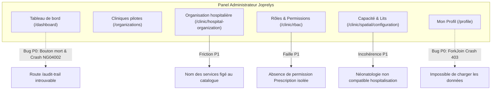
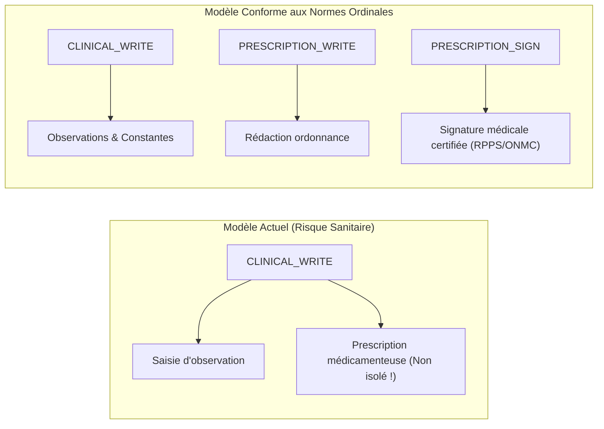

# Rapport d'Audit Clinique, Ergonomique et Réglementaire du Panel Administrateur Joprelys

> **Document de Référence d'Ingénierie & Qualité Médicale**  
> **Auteur :** Médecin Praticien & Expert International en Informatique Médicale / Systèmes d'Information Hospitaliers (SIH)  
> **Date :** 4 Octobre 2026  
> **Cible :** Joprelys HealthTech — Plateforme Recette (`recette.joprelys.com`)  
> **Compte audité :** `jocelin.fomekong@joprelys.com` (Rôle : `ADMIN_JOPRELYS`)

---

## 1. Synthèse Exécutive et Cadre de Référence

Sollicité en qualité de praticien clinicien rompu aux déploiements de dossiers patients informatisés (DPI) et aux exigences de certification hospitalière (HAS, JCI, standards HL7 FHIR), cet audit a pour mission d'éprouver le socle administrateur de **Joprelys Connect**.

### Le Bilan Global
L'architecture logicielle démontre une réelle maturité d'intention :
- Respect de la distinction internationale entre **localisation spatiale** (`Location`) et **structure médico-administrative** (`Organization`).
- Culture de sécurité des soins visible dans certaines granularités RBAC (ex: dissociation entre la décision médicale de sortie et le départ physique du lit).

Néanmoins, l'audit met en lumière des **incohérences cliniques pénalisantes**, des **angles morts médico-légaux majeurs**, ainsi que **deux anomalies techniques bloquantes (P0)** qui paralysent l'expérience administrateur.



---

## 2. Audit de l'Organisation Hospitalière (`/clinic/hospital-organization`)

### 2.1. Les Points Forts
1. **Découplage Spatial vs Organisationnel :** Le sous-titre de l'interface résume parfaitement le standard FHIR : *« Structurez les pôles, départements, services et unités de soins sans confondre organisation et localisation »*. Un service médical peut disposer de lits répartis sur plusieurs étages sans compromettre la logique fonctionnelle.
2. **Hiérarchie à 4 niveaux souple :**
   $$\text{Pôle} \longrightarrow \text{Département} \longrightarrow \text{Service} \longrightarrow \text{Unité de soins}$$
   Le fait que les niveaux supérieurs soient optionnels permet d'équiper aussi bien un cabinet de groupe qu'un Centre Hospitalier Universitaire (CHU).

### 2.2. Incohérences et Limites Majeures

#### 🔴 1. Blocage architectural sur le nom des Services (`name: null`)
Dans le composant `HospitalOrganizationPageComponent` (`chunk-CXAM2tyF.js`), la méthode `submit()` force `name: null` pour tout type `SERVICE` :
```javascript
let e = {
  code: t.code.trim(),
  unitType: t.unitType,
  parentId: t.parentId || null,
  name: t.unitType === "SERVICE" ? null : t.name.trim(),
  serviceCatalogCode: t.unitType === "SERVICE" ? t.serviceCatalogCode : null
};
```
* **Impact Clinique Réel :** Dans un hôpital de taille moyenne à grande, il existe fréquemment des services dédoublés (ex: *Chirurgie Aseptique* vs *Chirurgie Septique*, *Chirurgie Viscérale* vs *Chirurgie Orthopédique*). Ne proposer que le code générique `GENERAL_SURGERY` sans possibilité de personnaliser l'intitulé interdit la création de plusieurs services d'une même discipline.
* **Correction recommandée :** Rendre le `serviceCatalogCode` obligatoire (clé d'interopérabilité), mais **autoriser un champ complémentaire `name` éditable** pour individualiser le service.

#### 🔴 2. Asymétrie et Lacunes Critiques entre Catalogues (Services vs Spécialités)
L'interrogation des endpoints `/api/hospital-organization/catalogs/services` et `/specialties` révèle un décalage flagrant :

| Domaine Médical | Présent dans Services (14) ? | Présent dans Spécialités (10) ? | Diagnostic Clinique |
| :--- | :---: | :---: | :--- |
| **Urgences** | ✅ `EMERGENCY` | ❌ **ABSENT** | **Incohérence majeure :** Un médecin urgentiste ne peut pas renseigner sa spécialité d'urgentiste ! |
| **Traumatologie / Orthopédie** | ❌ **ABSENT** | ❌ **ABSENT** | Incompréhensible en Afrique subsaharienne où l'accidentologie routière représente un volume d'admissions critique. |
| **Néonatologie** | ❌ **ABSENT** | ❌ **ABSENT** | Impossible de distinguer la pédiatrie générale des soins intensifs néonataux. |
| **Infectiologie** | ❌ **ABSENT** | ❌ **ABSENT** | Indispensable pour la gestion du paludisme grave, tuberculose, VIH, fièvres hémorragiques. |
| **Gastro-entérologie / Endoscopie** | ❌ **ABSENT** | ❌ **ABSENT** | Absence de filière digestive médicale. |
| **Ophtalmologie / ORL / Stomatologie** | ❌ **ABSENT** | ❌ **ABSENT** | Activités de consultation externe et ambulatoire totalement oubliées. |
| **Néphrologie / Hémodialyse** | ❌ **ABSENT** | ❌ **ABSENT** | Manque critique pour les centres d'hémodialyse. |

#### 🟠 3. Absence de Gouvernance sur l'Unité de Soins
Le modèle actuel ne permet pas d'associer :
- Le **Praticien Responsable / Chef de Service** (responsabilité médico-légale des protocoles et prescriptions).
- Le **Cadre de Santé / Infirmier Major** (gestion logistique, dotation soignante et armoire à pharmacie de service).

---

## 3. Audit des Rôles et Permissions (RBAC) (`/clinic/rbac`)

L'API déploie **56 permissions réparties en 16 domaines**.

### 3.1. Les Points Remarquables (Excellence Clinique)
> [!TIP]
> **Découplage de la sortie d'hospitalisation :**  
> `HOSPITALIZATION_DISCHARGE_DECIDE` (médecin validant le diagnostic et le traitement de sortie) est séparé de `HOSPITALIZATION_PHYSICAL_DEPARTURE_CONFIRM` (soignant constatant la libération effective du lit). Cette dissociation élimine le syndrome classique du "lit fantôme libéré trop tôt".

- **Traçabilité de l'administration du médicament :** `HOSPITALIZATION_MEDICATION_ADMINISTER` trace la prise sans donner le pouvoir de prescrire.
- **Bris de glace d'urgence :** `PATIENT_EMERGENCY_ACCESS` offre un accès dérogatoire et audité au dossier en situation d'urgence vitale.
- **Identitovigilance :** `PATIENT_MERGE` sécurise la fusion de doublons d'identités.
- **Chaîne de possession médico-légale :** `EMERGENCY_BELONGINGS_WRITE` pour la traçabilité des scellés et valeurs des patients comateux ou blessés.

### 3.2. Failles Médico-Légales et Manques Critiques



#### 🔴 1. Absence d'une permission de Prescription Médicale dédiée
* **Faiblesse :** Dans le domaine `CLINIQUE`, seule la permission `CLINICAL_WRITE` est proposée.
* **Risque Médico-Légal :** La prescription de médicaments et stupéfiants est un **acte médical réservé aux docteurs en médecine**. Un profil soignant ayant besoin de `CLINICAL_WRITE` pour noter une transmission ne doit en aucun cas pouvoir ordonner une prescription.
* **Recommandation :** Créer `PRESCRIPTION_WRITE` et `PRESCRIPTION_SIGN`.

#### 🔴 2. Circuit du Médicament incomplet en Pharmacie
* **Faiblesse :** Le domaine `PHARMACIE` ne contient que `PHARMACY_PRESCRIPTION_READ` et `PHARMACY_STOCK_MANAGE`.
* **Risque Sanitaire :** Il n'existe **aucune permission pour la validation pharmaceutique** (détection des interactions, surdosages, contre-indications) ni pour la **dispensation / délivrance effective** (`PHARMACY_DISPENSE`).

#### 🟠 3. Verrouillage et Signature des Actes Médicaux
* **Faiblesse :** Absence de `CLINICAL_SIGN` ou `CONSULTATION_LOCK`. Un compte-rendu médical validé doit être scellé de manière inaltérable (avec horodatage certifié).

---

## 4. Audit de la Capacité d'Accueil et Topographie (`/clinic/spatial`)

L'architecture spatiale s'appuie sur le modèle hiérarchique :
$$\text{SITE} \longrightarrow \text{BUILDING} \longrightarrow \text{FLOOR} \longrightarrow \text{ZONE}$$

### Aberrations Identifiées sur les Types d'Espaces (`spaceTypes`)

> [!CAUTION]
> **Néonatologie non compatible hospitalisation :**  
> Dans `/api/spatial/configuration/space-types`, le type `NEONATAL_ROOM` possède l'indicateur :
> ```json
> { "code": "NEONATAL_ROOM", "inpatientCompatible": false }
> ```
> C'est une **aberration clinique directe**. Un nouveau-né sous couveuse ou photothérapie en néonatologie est un patient hospitalisé à part entière. Ce paramètre interdit techniquement d'y admettre un patient.

- **Box des Urgences (`EMERGENCY_BOX`) :** Également marqué `inpatientCompatible: false`. Cela empêche d'y gérer les lits d'**UHCD** (Unité d'Hospitalisation de Courte Durée, 12-24h) qui relèvent pourtant des urgences.
- **Absence de l'Ambulatoire (Hôpital de Jour) :** Aucune catégorie pour les fauteuils d'hémodialyse, de chimiothérapie ou de chirurgie ambulatoire.

---

## 5. Audit Détaillé des Écrans et Bugs Détectés

### 🚨 Bug Bloquant 1 : Crash du Journal d'Audit et Déconnexion (`/dashboard`)
* **Localisation :** Carte *« Journal d'Audit Sécurisé »* sur le tableau de bord.
* **Symptôme :** Le bouton `<button>Consulter</button>` est un élément statique sans action.
* **Crash :** Lorsque l'URL `/audit-trail` est appelée, le routeur Angular s'effondre avec une erreur fatale :
  ```text
  ERROR y: NG04002: Cannot match any routes. URL Segment: 'audit-trail'
      at Wf.noMatchError (main-OHGSPDVZ.js:5:60618)
  ```
  L'application est déstabilisée et redirige l'utilisateur vers la mire de connexion `/`.

### 🚨 Bug Bloquant 2 : Page "Mon Profil" inutilisable par crash 403 (`/profile`)
* **Localisation :** Module profil utilisateur (`/profile`).
* **Symptôme :** Affichage systématique d'une alerte rouge : *"Impossible de charger les données du profil."* Tous les champs sont bloqués.
* **Cause Technique :** Dans `chunk-CBdGwb1n.js`, le chargement utilise `forkJoin` :
  ```javascript
  forkJoin({
    profile: this.http.get("/api/profile"),
    assignments: this.staffApi.getOwnActiveAssignments() // GET /api/profile/assignments
  })
  ```
  L'appel `/api/profile` renvoie `200 OK`. Mais pour le compte `ADMIN_JOPRELYS`, `/api/profile/assignments` retourne :
  ```json
  {
    "status": 403,
    "title": "Collaborateur non rattaché à un établissement."
  }
  ```
  L'absence de `catchError` sur l'appel des affectations fait planter l'ensemble du `forkJoin`.

### ⚠️ Friction 3 : Formulaire de Création de Clinique sans Feedback Contextuel (`/organizations`)
* **Constat :** En cas d'oubli de champs obligatoires, une bannière globale *"Veuillez remplir les champs obligatoires."* s'affiche tout en haut, mais **aucun champ invalide n'est mis en évidence visuellement**.
* **Impact :** Sur un formulaire d'une dizaine de champs avec ascenseur, l'administrateur ne sait pas quel champ pose problème.
* **Ambiguïté :** La liste déroulante du type d'établissement (Hôpital, Clinique, Cabinet, Laboratoire, Pharmacie...) n'explique pas les impacts sur les modules débloqués.

### ⚠️ Friction 4 : Redondance sur le Tableau de Bord
Sur `/dashboard`, la carte *« Cliniques Pilotes »* et la carte *« Configuration Interop »* pointent toutes les deux vers la même URL `/organizations`.

### 🟡 Ergonomie, i18n et Typographie
1. **Traductions incomplètes :** En mode langue anglaise (`EN`), l'alerte d'erreur du profil et les consignes du téléversement de photos restent en français.
2. **Fil d'Ariane français :** Affiche `Profile` et `Clinic rbac` au lieu de `Mon profil` et `Rôles et autorisations`.
3. **Fautes d'accentuation dans l'UI :**
   - Bouton `Se deconnecter` (au lieu de `Se déconnecter`).
   - Lien footer `Confidentialite` (au lieu de `Confidentialité`).

---

## 6. Matrice d'Actions et Plan de Correction Priorisé

| Réf | Gravité | Composant / Module | Description de l'action corrective |
| :--- | :---: | :--- | :--- |
| **FIX-01** | 🚨 **P0** | **Profil (`/profile`)** | Ajouter un opérateur `.pipe(catchError(() => of([])))` sur `getOwnActiveAssignments()` pour éviter le crash 403 des comptes administrateurs plateforme. |
| **FIX-02** | 🚨 **P0** | **Dashboard / Routeur** | Déclarer la route `/audit-trail` ou brancher le bouton "Consulter" sur l'onglet d'audit de `/clinic/rbac`. |
| **FIX-03** | ⚠️ **P1** | **Organisation Hospitalière** | Permettre la saisie d'un nom libre `name` pour les Services afin de permettre les services dédoublés. |
| **FIX-04** | ⚠️ **P1** | **Référentiel des Catalogues** | Ajouter `EMERGENCY_MEDICINE` dans les spécialités, et introduire la Traumatologie, la Néonatologie et l'Infectiologie. |
| **FIX-05** | ⚠️ **P1** | **Topographie Spatiale** | Corriger le catalogue `spaceTypes` : passer `NEONATAL_ROOM` et `EMERGENCY_BOX` à `inpatientCompatible: true`. |
| **FIX-06** | ⚠️ **P1** | **Matrice RBAC** | Créer la permission `PRESCRIPTION_WRITE` (distincte de `CLINICAL_WRITE`) et `PHARMACY_DISPENSE`. |
| **FIX-07** | 💡 **P2** | **Formulaire Cliniques** | Ajouter la coloration d'erreur rouge (`has-error`) directement sous les inputs obligatoires non remplis. |
| **FIX-08** | 💡 **P2** | **Finitions UI / i18n** | Corriger les accents manquants et traduire les libellés anglais résiduels. |

---

*Ce rapport d'audit constitue le prérequis méthodologique avant l'initialisation de la première clinique pilote et le déploiement du parcours de soins.*
