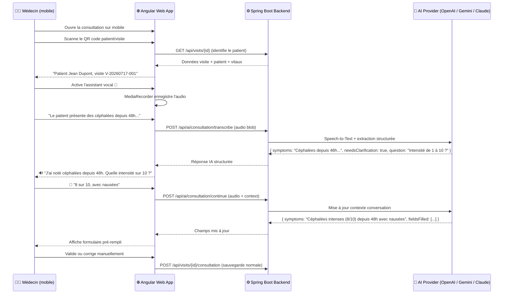
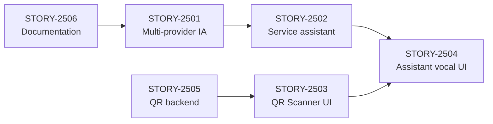

# EPIC-0024 — Assistant IA Vocal pour Consultations Médicales

> **Objectif** : Permettre au médecin, depuis son téléphone (app web mobile-first), de scanner un QR code patient, puis de remplir la consultation par la voix via un assistant IA conversationnel intelligent, avec correction interactive et validation finale.

## Vue d'ensemble



---

## Décision d'architecture

| Décision | Choix | Justification |
|---|---|---|
| **Plateforme** | Angular web (pas Flutter) | App web déjà mobile-first, consultation déjà implémentée, Web APIs suffisantes (MediaRecorder + BarcodeDetector) |
| **Architecture IA** | Strategy Pattern multi-provider | Switchable via `application.yml` entre OpenAI, Gemini, Claude |
| **Speech-to-Text** | Via API IA backend (pas Web Speech API) | Plus fiable, multilingue, fonctionne sur tous navigateurs, contexte médical |
| **Text-to-Speech** | Web Speech API (navigateur) | Gratuit, immédiat, suffisant pour les confirmations IA |
| **QR Scanner** | Bibliothèque `html5-qrcode` | Fonctionne sur tous navigateurs mobiles, pas de dépendance native |
| **Conversation** | Stateful côté backend (session in-memory + Redis optionnel) | Permet continuité du dialogue, contexte cumulé |

---

## Champs de consultation à remplir par l'IA

| Champ | Obligatoire | Type | Exemple de dictée |
|---|---|---|---|
| `symptoms` | ✅ Oui | TEXT (5000 max) | "Céphalées intenses depuis 48h avec nausées" |
| `clinicalExam` | Non | TEXT (5000 max) | "Patient conscient, orienté, tension 14/8, température 37.2" |
| `suspectedDiagnosis` | Non | TEXT (5000 max) | "Suspicion de migraine avec aura" |
| `diagnosis` | ✅ Oui | TEXT (5000 max) | "Migraine sans aura, épisode aigu" |
| `finalDiagnosis` | Non | TEXT (5000 max) | "Migraine épisodique confirmée" |
| `conclusion` | Non | TEXT (5000 max) | "Amélioration attendue sous traitement" |
| `advice` | Non | TEXT (3000 max) | "Repos, hydratation, éviter les écrans" |
| `followUp` | Non | TEXT (1000 max) | "Contrôle dans 7 jours si persistance" |

---

## Découpage : EPIC → User Stories → Tasks

### STORY-2501 — Backend : Abstraction multi-provider IA

> **En tant que** développeur backend, **je veux** une couche d'abstraction IA multi-provider switchable par configuration, **afin que** le système puisse utiliser OpenAI, Gemini ou Claude sans changer le code.

| Attribut | Valeur |
|---|---|
| **Priorité** | P0 |
| **Story Points** | 5 |
| **Profil** | Senior Backend |
| **Est. Senior** | 2.0j |
| **Est. Intermédiaire** | 3.0j |
| **Risque** | Moyen (dépendance externe API, gestion des clés) |
| **Stack** | Spring Boot / Java 21 |

**Critères d'acceptation :**
- [ ] Interface `AiProvider` avec méthodes `transcribeAudio(byte[] audio, String locale)` et `chat(List<Message> messages, String systemPrompt)`
- [ ] Implémentation `OpenAiProvider` fonctionnelle (modèle GPT-4o + Whisper)
- [ ] Implémentation `GeminiProvider` fonctionnelle (modèle Gemini 2.5 Pro/Flash)
- [ ] Implémentation `ClaudeProvider` fonctionnelle (modèle Claude Sonnet/Opus)
- [ ] Configuration dans `application.yml` : `joprelys.ai.provider: openai|gemini|claude`
- [ ] Clés API injectées via variables d'environnement (`${OPENAI_API_KEY:}`, etc.)
- [ ] Factory/strategy qui résout le bon provider au démarrage
- [ ] Tests unitaires avec mocks pour chaque provider
- [ ] Gestion d'erreur gracieuse (timeout, quota, provider indisponible)

**Tasks :**

| Task | Description | SP | Est. |
|---|---|---|---|
| TASK-2501-A | Créer le package `com.joprelys.backend.ai` avec l'interface `AiProvider` et les DTOs | 1 | 0.25j |
| TASK-2501-B | Implémenter `OpenAiProvider` (Whisper STT + GPT-4o chat) | 2 | 0.5j |
| TASK-2501-C | Implémenter `GeminiProvider` (Gemini multimodal audio + chat) | 1 | 0.5j |
| TASK-2501-D | Implémenter `ClaudeProvider` (Claude Messages API) | 1 | 0.5j |
| TASK-2501-E | Factory, configuration YAML, tests unitaires | 1 | 0.25j |

---

### STORY-2502 — Backend : Service d'assistant consultation IA

> **En tant que** médecin, **je veux** que le backend traite mes enregistrements vocaux et extraie les champs de consultation structurés, **afin que** je puisse remplir le formulaire par la voix.

| Attribut | Valeur |
|---|---|
| **Priorité** | P0 |
| **Story Points** | 8 |
| **Profil** | Senior Backend |
| **Est. Senior** | 3.0j |
| **Est. Intermédiaire** | 4.5j |
| **Risque** | Élevé (prompt engineering médical, gestion du contexte conversationnel) |
| **Stack** | Spring Boot / Java 21 |

**Critères d'acceptation :**
- [ ] Endpoint `POST /api/ai/consultation/{visitId}/start` — Démarre une session IA pour une visite
- [ ] Endpoint `POST /api/ai/consultation/{visitId}/message` — Envoie audio ou texte, reçoit extraction + question de clarification
- [ ] Endpoint `GET /api/ai/consultation/{visitId}/session` — Récupère l'état courant de la session (champs remplis + historique)
- [ ] Endpoint `DELETE /api/ai/consultation/{visitId}/session` — Termine la session IA
- [ ] System prompt médical structuré avec instructions d'extraction des 8 champs
- [ ] L'IA demande des clarifications quand le contenu est ambigu ou incomplet
- [ ] L'IA confirme chaque champ rempli et propose de passer au suivant
- [ ] Gestion du contexte conversationnel (historique des échanges)
- [ ] Sécurité : RBAC (MEDECIN, ADMIN_CLINIQUE), multi-tenant
- [ ] Aucune persistance des données audio (traitement en streaming, pas de stockage)
- [ ] Tests avec scénarios médicaux réalistes

**Tasks :**

| Task | Description | SP | Est. |
|---|---|---|---|
| TASK-2502-A | `AiConsultationController` — Endpoints REST | 1 | 0.25j |
| TASK-2502-B | `AiConsultationService` — Orchestration transcription + extraction | 3 | 1.0j |
| TASK-2502-C | `ConsultationPromptBuilder` — System prompt médical et extraction structurée (JSON) | 2 | 0.75j |
| TASK-2502-D | `ConversationSessionManager` — Gestion sessions in-memory (ConcurrentHashMap + TTL) | 1 | 0.5j |
| TASK-2502-E | Tests d'intégration et scénarios médicaux | 1 | 0.5j |

---

### STORY-2503 — Frontend : QR Code Scanner sur mobile

> **En tant que** médecin sur mon téléphone, **je veux** scanner le QR code du patient/visite, **afin que** la consultation s'ouvre automatiquement sans chercher dans les listes.

| Attribut | Valeur |
|---|---|
| **Priorité** | P0 |
| **Story Points** | 3 |
| **Profil** | Frontend Intermédiaire |
| **Est. Senior** | 1.0j |
| **Est. Intermédiaire** | 1.5j |
| **Risque** | Faible (librairie éprouvée, Web API stable) |
| **Stack** | Angular / TypeScript |

**Critères d'acceptation :**
- [ ] Bouton "Scanner QR" visible sur le dashboard médecin (mobile-first)
- [ ] Ouverture de la caméra via `html5-qrcode` (permission gérée proprement)
- [ ] Décodage du QR → extraction de l'ID visite ou patient
- [ ] Navigation automatique vers `/clinic/consultation/{visitId}`
- [ ] Gestion des erreurs (QR invalide, pas de caméra, permission refusée)
- [ ] UI conforme DESIGN.md (coins sobres, Brand Cyan, light/dark)
- [ ] i18n FR/EN complet
- [ ] Composant réutilisable dans `shared/ui/qr-scanner/`

**Tasks :**

| Task | Description | SP | Est. |
|---|---|---|---|
| TASK-2503-A | Installer `html5-qrcode`, créer composant `QrScannerComponent` | 1 | 0.25j |
| TASK-2503-B | Intégration dans le dashboard médecin avec navigation | 1 | 0.25j |
| TASK-2503-C | Gestion des erreurs, i18n, tests, responsive | 1 | 0.5j |

---

### STORY-2504 — Frontend : Assistant vocal IA dans la consultation

> **En tant que** médecin, **je veux** un bouton micro dans le formulaire de consultation qui active un assistant vocal IA interactif, **afin que** je puisse dicter les observations et que l'IA remplisse les champs avec confirmation.

| Attribut | Valeur |
|---|---|
| **Priorité** | P0 |
| **Story Points** | 8 |
| **Profil** | Senior Frontend |
| **Est. Senior** | 3.0j |
| **Est. Intermédiaire** | 4.5j |
| **Risque** | Élevé (UX conversationnelle complexe, gestion des états audio) |
| **Stack** | Angular / TypeScript / Web APIs |

**Critères d'acceptation :**
- [ ] Bouton micro flottant (FAB) dans la consultation, activable/désactivable
- [ ] États visuels clairs : idle, écoute (animation pulse), traitement IA (loader), réponse (texte + TTS)
- [ ] Enregistrement audio via `MediaRecorder` API, envoi au backend comme `multipart/form-data`
- [ ] Affichage de la réponse IA (texte + champs remplis mis en surbrillance)
- [ ] Text-to-Speech navigateur pour la réponse vocale de l'IA
- [ ] Panneau de conversation latéral/bottom-sheet montrant l'historique du dialogue
- [ ] Le médecin peut corriger par la voix : "Non, corrige les symptômes, ajoute fièvre"
- [ ] Les champs du formulaire se mettent à jour en temps réel avec animation
- [ ] Bouton "Valider tout" pour confirmer les champs remplis par l'IA
- [ ] Mobile-first : optimisé pour usage téléphone (touch targets, bottom sheet)
- [ ] i18n FR/EN, light/dark, accessibilité (ARIA labels pour le micro)
- [ ] Service Angular dédié `AiAssistantService` (pas de logique dans le composant)

**Tasks :**

| Task | Description | SP | Est. |
|---|---|---|---|
| TASK-2504-A | `AiAssistantService` — Gestion audio (record/stop/send), appels API, TTS | 2 | 0.75j |
| TASK-2504-B | `VoiceAssistantPanelComponent` — UI conversationnelle (bottom sheet mobile) | 3 | 1.0j |
| TASK-2504-C | Intégration dans `ConsultationComponent` — auto-fill champs + animations | 2 | 0.75j |
| TASK-2504-D | i18n, light/dark, accessibilité, tests, edge cases | 1 | 0.5j |

---

### STORY-2505 — Backend : Génération QR code pour les visites

> **En tant que** système, **je veux** que chaque visite active génère un QR code scannable contenant l'identifiant de la visite, **afin que** le médecin puisse scanner et accéder directement à la consultation.

| Attribut | Valeur |
|---|---|
| **Priorité** | P1 |
| **Story Points** | 2 |
| **Profil** | Backend Intermédiaire |
| **Est. Senior** | 0.5j |
| **Est. Intermédiaire** | 0.75j |
| **Risque** | Faible (ZXing déjà en place) |
| **Stack** | Spring Boot / ZXing |

**Critères d'acceptation :**
- [ ] Endpoint `GET /api/visits/{id}/qrcode` retournant une image PNG du QR code
- [ ] Le QR code contient une URL structurée : `{baseUrl}/clinic/consultation/{visitId}`
- [ ] QR code intégré dans les tickets d'admission imprimés (si applicable)
- [ ] Réutilisation du `QrCodeGeneratorService` existant
- [ ] Sécurité : seuls les rôles cliniques peuvent générer le QR

**Tasks :**

| Task | Description | SP | Est. |
|---|---|---|---|
| TASK-2505-A | Ajouter endpoint QR dans `VisitController` + réutiliser `QrCodeGeneratorService` | 1 | 0.25j |
| TASK-2505-B | Intégrer QR dans ticket d'accueil/admission si impression existante | 1 | 0.25j |

---

### STORY-2506 — Documentation, ADR et Sécurité

> **En tant que** équipe technique, **je veux** la documentation complète de la fonctionnalité IA vocale, **afin que** la solution soit maintenable, sécurisée et auditable.

| Attribut | Valeur |
|---|---|
| **Priorité** | P0 |
| **Story Points** | 3 |
| **Profil** | Senior (Documentation First) |
| **Est. Senior** | 1.0j |
| **Est. Intermédiaire** | 1.5j |
| **Risque** | Faible |

**Tasks :**

| Task | Description | SP | Est. |
|---|---|---|---|
| TASK-2506-A | `docs/features/ai-voice-consultation/FUNCTIONAL-SPEC.md` | 1 | 0.25j |
| TASK-2506-B | `docs/features/ai-voice-consultation/TECHNICAL-DESIGN.md` | 1 | 0.25j |
| TASK-2506-C | `docs/features/ai-voice-consultation/API-CONTRACT.md` | 0.5 | 0.25j |
| TASK-2506-D | ADR choix provider IA (`docs/adr/ADR-AI-PROVIDER-STRATEGY.md`) | 0.5 | 0.25j |

---

## Récapitulatif estimation

| Story | SP | Est. Senior | Profil |
|---|---|---|---|
| STORY-2501 — Abstraction multi-provider IA | 5 | 2.0j | Senior Backend |
| STORY-2502 — Service assistant consultation IA | 8 | 3.0j | Senior Backend |
| STORY-2503 — QR Code Scanner mobile | 3 | 1.0j | Frontend Intermédiaire |
| STORY-2504 — Assistant vocal UI (Angular) | 8 | 3.0j | Senior Frontend |
| STORY-2505 — QR code visites (backend) | 2 | 0.5j | Backend Intermédiaire |
| STORY-2506 — Documentation, ADR, Sécurité | 3 | 1.0j | Senior |
| **TOTAL EPIC** | **29** | **10.5j** | **Senior full-stack** |

> [!IMPORTANT]
> **Majorations applicables** (selon `ESTIMATION-GUIDE.md`) :
> - Multi-stack (Spring Boot + Angular) : **+30%** → 13.7j
> - Dépendance externe API IA : **+20%** → 16.4j
> - Sécurité données médicales : **+20%** → 19.7j
> - **Estimation réaliste totale : ~15-20 jours senior**

---

## Configuration `application.yml` proposée

```yaml
joprelys:
  ai:
    enabled: ${JOPRELYS_AI_ENABLED:false}
    provider: ${JOPRELYS_AI_PROVIDER:gemini}          # openai | gemini | claude
    session-ttl-minutes: ${JOPRELYS_AI_SESSION_TTL:30}
    max-conversation-turns: ${JOPRELYS_AI_MAX_TURNS:20}
    locale: ${JOPRELYS_AI_LOCALE:fr}
    openai:
      api-key: ${OPENAI_API_KEY:}
      model: ${OPENAI_MODEL:gpt-4o}
      whisper-model: ${OPENAI_WHISPER_MODEL:whisper-1}
      base-url: ${OPENAI_BASE_URL:https://api.openai.com/v1}
    gemini:
      api-key: ${GEMINI_API_KEY:}
      model: ${GEMINI_MODEL:gemini-2.5-flash}
      base-url: ${GEMINI_BASE_URL:https://generativelanguage.googleapis.com/v1beta}
    claude:
      api-key: ${ANTHROPIC_API_KEY:}
      model: ${CLAUDE_MODEL:claude-sonnet-4-20250514}
      base-url: ${CLAUDE_BASE_URL:https://api.anthropic.com/v1}
```

---

## Architecture backend proposée

```
com.joprelys.backend.ai/
├── api/
│   ├── AiConsultationController.java       # REST endpoints
│   ├── AiMessageRequest.java              # { audio?: Blob, text?: String }
│   ├── AiConsultationResponse.java        # { fields: {}, message: String, needsClarification: boolean }
│   └── AiSessionResponse.java            # Session state DTO
├── application/
│   ├── AiConsultationService.java         # Orchestration principale
│   ├── ConsultationPromptBuilder.java     # System prompt médical + extraction JSON
│   └── ConversationSessionManager.java   # Sessions in-memory + TTL
├── domain/
│   ├── AiProvider.java                    # Interface Strategy
│   ├── AiMessage.java                     # Record (role, content)
│   ├── AiTranscription.java              # Record (text, locale, confidence)
│   └── ConsultationExtraction.java       # Record (champs extraits + clarifications)
└── infrastructure/
    ├── AiProviderConfig.java              # @Configuration + Factory
    ├── openai/
    │   └── OpenAiProvider.java            # RestClient → OpenAI
    ├── gemini/
    │   └── GeminiProvider.java            # RestClient → Gemini
    └── claude/
        └── ClaudeProvider.java            # RestClient → Anthropic
```

---

## Ordre de livraison recommandé



| Phase | Stories | Sprint | Objectif |
|---|---|---|---|
| **Phase 1** | STORY-2506 + STORY-2501 | SPRINT-0015 | Fondations (docs + abstraction IA) |
| **Phase 2** | STORY-2502 + STORY-2505 | SPRINT-0015 | Backend complet (assistant + QR) |
| **Phase 3** | STORY-2503 + STORY-2504 | SPRINT-0016 | Frontend complet (scanner + assistant vocal) |

---

## Risques identifiés

| Risque | Impact | Mitigation |
|---|---|---|
| Qualité transcription médicale (termes techniques) | Élevé | System prompt avec vocabulaire médical, tests avec audio réel |
| Coût API IA (appels fréquents par consultation) | Moyen | Gemini Flash par défaut (moins cher), monitoring des tokens |
| Latence réseau (audio upload + IA + réponse) | Moyen | Compression audio, streaming si possible, feedback UX |
| Compatibilité navigateur mobile (caméra, micro) | Faible | `html5-qrcode` éprouvé, `MediaRecorder` supporté partout |
| Confidentialité données vocales médicales | Élevé | Pas de stockage audio, HTTPS obligatoire, RGPD/HDS compliance |

---

## Impact SemVer

> **MINOR bump** : nouvelle fonctionnalité rétrocompatible (nouveaux endpoints IA, nouveau composant QR + assistant vocal).
> Version cible : **0.11.0**
